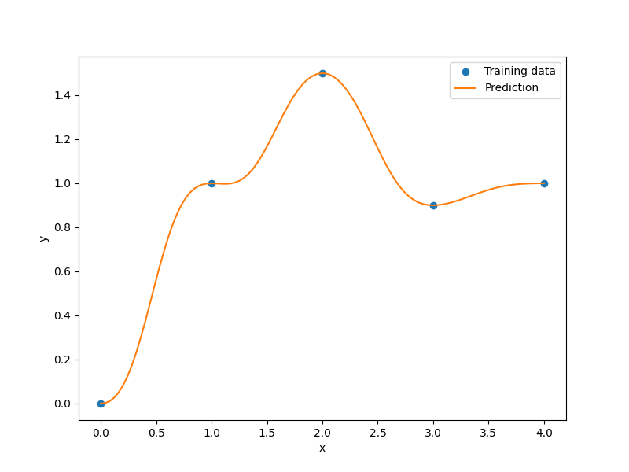

Inverse-distance weighting
==========================

The inverse distance weighting [1]_ (IDW) model is an interpolating method
and the unknown points are calculated with a weighted average of the sampling points.

The prediction equation for IDW is

.. math ::

  y =
  \left\{
  \begin{array}{ll}
    \frac{\sum_i^{nt} \beta(\mathbf{x}, \mathbf{xt}_i) yt_i}{\sum_i^{nt} \beta(\mathbf{x}, \mathbf{xt}_i)},
    & \text{if} \quad \mathbf{x} \neq \mathbf{xt}_i \quad \forall i\\
    yt_i
    & \text{if} \quad \mathbf{x} = \mathbf{xt}_i \quad \text{for some} \; i\\
  \end{array}
  \right. ,

where
:math:`\mathbf{x} \in \mathbb{R}^{nx}` is the prediction input vector,
:math:`y \in \mathbb{R}` is the prediction output,
:math:`\mathbf{xt}_i \in \mathbb{R}^{nx}` is the input vector for the :math:`i` th training point,
and
:math:`yt_i \in \mathbb{R}` is the output value for the :math:`i` th training point.
The weighting function :math:`\beta` is defined by

.. math ::

  \beta( \mathbf{x}_i , \mathbf{x}_j ) = || \mathbf{x}_i - \mathbf{x}_j ||_2 ^ {-p} ,

where :math:`p` a positive real number, called the power parameter.
This parameter must be strictly greater than 1 for the derivatives to be continuous.

.. [1] Shepard, D., A Two-dimensional Interpolation Function for Irregularly-spaced Data, Proceedings of the 1968 23rd ACM National Conference, 1968, pp. 517--524.

Usage
-----

.. code-block:: python

  import numpy as np
  import matplotlib.pyplot as plt
  
  from smt.surrogate_models import IDW
  
  xt = np.array([0.0, 1.0, 2.0, 3.0, 4.0])
  yt = np.array([0.0, 1.0, 1.5, 0.9, 1.0])
  
  sm = IDW(p=2)
  sm.set_training_values(xt, yt)
  sm.train()
  
  num = 100
  x = np.linspace(0.0, 4.0, num)
  y = sm.predict_values(x)
  
  plt.plot(xt, yt, "o")
  plt.plot(x, y)
  plt.xlabel("x")
  plt.ylabel("y")
  plt.legend(["Training data", "Prediction"])
  plt.show()
  
::

  ___________________________________________________________________________
     
                                      IDW
  ___________________________________________________________________________
     
   Problem size
     
        # training points.        : 5
     
  ___________________________________________________________________________
     
   Training
     
     Training ...
     Training - done. Time (sec):  0.0000000
  ___________________________________________________________________________
     
   Evaluation
     
        # eval points. : 100
     
     Predicting ...
     Predicting - done. Time (sec):  0.0000000
     
     Prediction time/pt. (sec) :  0.0000000
     
  

Options
-------

.. list-table:: List of options
  :header-rows: 1
  :widths: 15, 10, 20, 20, 30
  :stub-columns: 0

  *  -  Option
     -  Default
     -  Acceptable values
     -  Acceptable types
     -  Description
  *  -  print_global
     -  True
     -  None
     -  ['bool']
     -  Global print toggle. If False, all printing is suppressed
  *  -  print_training
     -  True
     -  None
     -  ['bool']
     -  Whether to print training information
  *  -  print_prediction
     -  True
     -  None
     -  ['bool']
     -  Whether to print prediction information
  *  -  print_problem
     -  True
     -  None
     -  ['bool']
     -  Whether to print problem information
  *  -  print_solver
     -  True
     -  None
     -  ['bool']
     -  Whether to print solver information
  *  -  p
     -  2.5
     -  None
     -  ['int', 'float']
     -  order of distance norm
  *  -  data_dir
     -  None
     -  None
     -  ['str']
     -  Directory for loading / saving cached data; None means do not save or load
