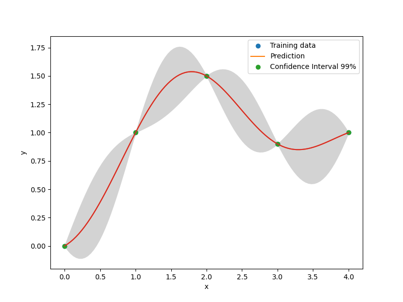

.. _kpls-ref-label:

KPLS
====

KPLS is a kriging model that uses the partial least squares (PLS) method. KPLS is faster than kriging because of the low number of hyperparameters to be estimated while maintaining a good accuracy.
This model is suitable for high-dimensional problems due to the kernel constructed through the PLS method. The PLS method [1]_ is a well known tool for high-dimensional problems that searches the direction that maximizes the variance between the input and output variables. This is done by a projection in a smaller space spanned by the so-called principal components. The PLS information are integrated into the kriging correlation matrix to scale the number of inputs by reducing the number of hyperparameters. The number of principal components  :math:`h` , which corresponds to the number of hyperparameters for KPLS and much lower than :math:`nx` (number of dimension of the problem), usually does not exceed 4 components:

.. math ::
  \prod\limits_{l=1}^{nx}\exp\left(-\theta_l\left(x_l^{(i)}-x_l^{(j)}\right)^2\right),\qquad \qquad \qquad \prod\limits_{k=1}^h \prod\limits_{l=1}^{nx} \exp\left(-\theta_k\left(w_{*l}^{(k)}x_l^{(i)}-w_{*l}^{(k)}x_l^{(j)}\right)^{2}\right) \quad \forall\ \theta_l,\theta_k\in\mathbb{R}^+\\
  \text{Standard Gaussian correlation function} \quad \qquad\text{PLS-Gaussian correlation function}\qquad \qquad\qquad\quad

Both absolute exponential and squared exponential kernels are available for KPLS model. More details about the KPLS approach could be found in these sources [2]_.

For an automatic selection of the number of components :math:`h`, the adjusted Wold's R criterion is implemented  as detailed in [3]_.
	
.. [1] Wold, H., Soft modeling by latent variables: the nonlinear iterative partial least squares approach, Perspectives in probability and statistics, papers in honour of MS Bartlett, 1975, pp. 520--540.

.. [2] Bouhlel, M. A. and Bartoli, N. and  Otsmane, A. and Morlier, J., Improving kriging surrogates of high-dimensional design models by Partial Least Squares dimension reduction, Structural and Multidisciplinary Optimization, Vol. 53, No. 5, 2016, pp. 935--952.

.. [3] Saves, P. and Bartoli, N. and Diouane, Y. and Lefebvre, T. and Morlier, J. and David, C. and Nguyen Van, E. and Defoort, S., Bayesian optimization for mixed variables using an adaptive dimension reduction process: applications to aircraft design, AIAA SCITECH 2022 Forum, pp. 0082. 

Usage
-----

.. code-block:: python

  import numpy as np
  import matplotlib.pyplot as plt
  
  from smt.surrogate_models import KPLS
  
  xt = np.array([0.0, 1.0, 2.0, 3.0, 4.0])
  yt = np.array([0.0, 1.0, 1.5, 0.9, 1.0])
  
  sm = KPLS(theta0=[1e-2])
  sm.set_training_values(xt, yt)
  sm.train()
  
  num = 100
  x = np.linspace(0.0, 4.0, num)
  y = sm.predict_values(x)
  # estimated variance
  # add a plot with variance
  s2 = sm.predict_variances(x)
  # to compute the derivative according to the first variable
  dydx = sm.predict_derivatives(xt, 0)
  
  plt.plot(xt, yt, "o")
  plt.plot(x, y)
  plt.xlabel("x")
  plt.ylabel("y")
  plt.legend(["Training data", "Prediction"])
  plt.show()
  
  plt.plot(xt, yt, "o")
  plt.plot(x, y)
  plt.fill_between(
      np.ravel(x),
      np.ravel(y - 3 * np.sqrt(s2)),
      np.ravel(y + 3 * np.sqrt(s2)),
      color="lightgrey",
  )
  plt.xlabel("x")
  plt.ylabel("y")
  plt.legend(["Training data", "Prediction", "Confidence Interval 99%"])
  plt.show()
  
::

  ___________________________________________________________________________
     
                                     KPLS
  ___________________________________________________________________________
     
   Problem size
     
        # training points.        : 5
     
  ___________________________________________________________________________
     
   Training
     
     Training ...
     Training - done. Time (sec):  0.0449092
  ___________________________________________________________________________
     
   Evaluation
     
        # eval points. : 100
     
     Predicting ...
     Predicting - done. Time (sec):  0.0000000
     
     Prediction time/pt. (sec) :  0.0000000
     
  ___________________________________________________________________________
     
   Evaluation
     
        # eval points. : 5
     
     Predicting ...
     Predicting - done. Time (sec):  0.0000000
     
     Prediction time/pt. (sec) :  0.0000000
     
  

Usage with an automatic number of components
--------------------------------------------

.. code-block:: python

  import numpy as np
  import matplotlib.pyplot as plt
  from smt.surrogate_models import KPLS
  from smt.problems import TensorProduct
  from smt.sampling_methods import LHS
  
  # The problem is the exponential problem with dimension 10
  ndim = 10
  prob = TensorProduct(ndim=ndim, func="exp")
  
  sm = KPLS(eval_n_comp=True)
  samp = LHS(xlimits=prob.xlimits, random_state=42)
  np.random.seed(0)
  xt = samp(50)
  yt = prob(xt)
  np.random.seed(1)
  sm.set_training_values(xt, yt)
  sm.train()
  
  ## The model automatically choose a dimension of 3
  l = sm.options["n_comp"]
  print("\n The model automatically choose " + str(l) + " components.")
  
  ## You can predict a 10-dimension point from the 3-dimensional model
  print(sm.predict_values(np.array([[1, 2, 3, 4, 5, 6, 7, 8, 9, 10]])))
  print(sm.predict_variances(np.array([[1, 2, 3, 4, 5, 6, 7, 8, 9, 10]])))
  
::

  ___________________________________________________________________________
     
                                     KPLS
  ___________________________________________________________________________
     
   Problem size
     
        # training points.        : 50
     
  ___________________________________________________________________________
     
   Training
     
     Training ...
     Training - done. Time (sec):  3.3513072
  
   The model automatically choose 3 components.
  ___________________________________________________________________________
     
   Evaluation
     
        # eval points. : 1
     
     Predicting ...
     Predicting - done. Time (sec):  0.0000000
     
     Prediction time/pt. (sec) :  0.0000000
     
  [[20.57448753]]
  [[1073.87724138]]
  

Options
-------

.. list-table:: List of options
  :header-rows: 1
  :widths: 15, 10, 20, 20, 30
  :stub-columns: 0

  *  -  Option
     -  Default
     -  Acceptable values
     -  Acceptable types
     -  Description
  *  -  print_global
     -  True
     -  None
     -  ['bool']
     -  Global print toggle. If False, all printing is suppressed
  *  -  print_training
     -  True
     -  None
     -  ['bool']
     -  Whether to print training information
  *  -  print_prediction
     -  True
     -  None
     -  ['bool']
     -  Whether to print prediction information
  *  -  print_problem
     -  True
     -  None
     -  ['bool']
     -  Whether to print problem information
  *  -  print_solver
     -  True
     -  None
     -  ['bool']
     -  Whether to print solver information
  *  -  poly
     -  constant
     -  ['constant', 'linear', 'quadratic']
     -  ['str']
     -  Regression function type
  *  -  corr
     -  squar_exp
     -  ['abs_exp', 'squar_exp']
     -  ['str']
     -  Correlation function type
  *  -  categorical_kernel
     -  None
     -  ['continuous_relaxation_matrix_kernel', 'gower_matrix_kernel', 'exponential_homoscedastic_matrix_kernel', 'homoscedastic_matrix_kernel']
     -  None
     -  The kernel to use for categorical inputs. Only for non continuous Kriging
  *  -  xtypes
     -  None
     -  None
     -  ['list']
     -  x type specifications: either FLOAT for continuous, INT for integer or (ENUM n) for categorical dimension with n levels
  *  -  nugget
     -  2.220446049250313e-14
     -  None
     -  ['float']
     -  a jitter for numerical stability
  *  -  theta0
     -  [0.01]
     -  None
     -  ['list', 'ndarray']
     -  Initial hyperparameters
  *  -  theta_bounds
     -  [1e-06, 20.0]
     -  None
     -  ['list', 'ndarray']
     -  bounds for hyperparameters
  *  -  hyper_opt
     -  Cobyla
     -  ['Cobyla', 'TNC']
     -  ['str']
     -  Optimiser for hyperparameters optimisation
  *  -  eval_noise
     -  False
     -  [True, False]
     -  ['bool']
     -  noise evaluation flag
  *  -  noise0
     -  [0.0]
     -  None
     -  ['list', 'ndarray']
     -  Initial noise hyperparameters
  *  -  noise_bounds
     -  [2.220446049250313e-14, 10000000000.0]
     -  None
     -  ['list', 'ndarray']
     -  bounds for noise hyperparameters
  *  -  use_het_noise
     -  False
     -  [True, False]
     -  ['bool']
     -  heteroscedastic noise evaluation flag
  *  -  n_start
     -  10
     -  None
     -  ['int']
     -  number of optimizer runs (multistart method)
  *  -  n_comp
     -  1
     -  None
     -  ['int']
     -  Number of principal components
  *  -  eval_n_comp
     -  False
     -  [True, False]
     -  ['bool']
     -  n_comp evaluation flag
  *  -  eval_comp_treshold
     -  1.0
     -  None
     -  ['float']
     -  n_comp evaluation treshold for Wold's R criterion
  *  -  cat_kernel_comps
     -  None
     -  None
     -  ['list']
     -  Number of components for PLS categorical kernel
