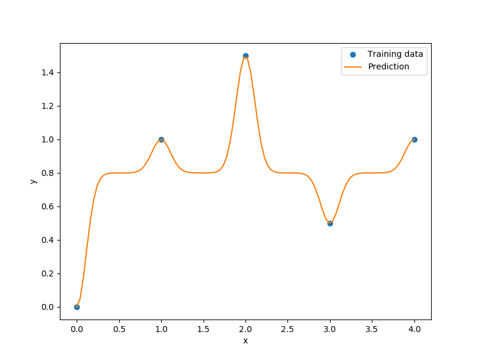

.. _kplsk-ref-label:

KPLSK
=====

KPLSK is a KPLS-based model and is basically built in two steps.
The first step consists in running KPLS and giving the estimate hyperparameters expressed in the reduced space with a number of dimensions equals to :math:`h`.
The second step consists in expressing the estimate hyperparameters in the original space with a number of dimensions equals to :math:`nx`, and then using it as a starting point to locally optimizing the likelihood function of a standard kriging.
The idea here is guessing a "good" initial hyperparameters and applying a gradient-based optimization using a classic kriging-kernels.
The "good" guess will be provided by KPLS: the solutions :math:`\left(\theta_1^*,\dots,\theta_h^*\right)` and the PLS-coefficients :math:`\left(w_1^{(k)},\dots,w_{nx}^{(k)}\right)` for :math:`k=1,\dots,h`.
By a change of variables :math:`\eta_l=\sum_{k=1}^h\theta_k^*{w^{(k)}_l}^2`, for :math:`l=1,\dots,nx`, we can express the initial hyperparameters point in the original space.
In the following example, a KPLS-Gaussian kernel function :math:`k_{\text{KPLS}}` is used for the demonstration (More details are given in [1]_):

.. math ::
  k_{\text{KPLS}}({\bf x}^{(i)},{\bf x}^{(j)}) &=&\sigma\prod\limits_{k=1}^h\prod\limits_{l=1}^{nx}\exp{\left(-\theta_k {w_l^{(k)}}^2\left(x_l^{(i)}-x_l^{(j)}\right)^2\right)}\\
  &=&\sigma\exp\left(\sum\limits_{l=1}^{nx}\sum\limits_{k=1}^h-\theta_k{w_l^{(k)}}^2\left(x_l^{(i)}-x_l^{(j)}\right)^2\right)\qquad \text{Change of variables}\\
  &=&\sigma\exp\left(\sum\limits_{l=1}^{nx}-\eta_l\left(x_l^{(i)}-x_l^{(j)}\right)^2\right)\\
  &=&\sigma\prod\limits_{l=1}^{nx}\exp\left(-\eta_l\left(x_l^{(i)}-x_l^{(j)}\right)^2\right).\\

:math:`\prod\limits_{l=1}^{nx}\exp\left(-\eta_l\left(x_l^{(i)}-x_l^{(j)}\right)^2\right)` is a standard Gaussian kernel function.

Subsequently, the hyperparameters point :math:`\left(\eta_1=\sum_{k=1}^h\theta_k^*{w^{(k)}_1}^2,\dots,\eta_{nx}=\sum_{k=1}^h\theta_k^*{w^{(k)}_{nx}}^2\right)` is used as a starting point for a gradient-based optimization applied on a standard kriging method.

.. [1] Bouhlel, M. A., Bartoli, N., Otsmane, A., and Morlier, J., An Improved Approach for Estimating the Hyperparameters of the Kriging Model for High-Dimensional Problems through the Partial Least Squares Method," Mathematical Problems in Engineering, vol. 2016, Article ID 6723410, 2016.

Usage
-----

.. code-block:: python

  import numpy as np
  import matplotlib.pyplot as plt
  
  from smt.surrogate_models import KPLSK
  
  xt = np.array([0.0, 1.0, 2.0, 3.0, 4.0])
  yt = np.array([0.0, 1.0, 1.5, 0.9, 1.0])
  
  sm = KPLSK(theta0=[1e-2])
  sm.set_training_values(xt, yt)
  sm.train()
  
  num = 100
  x = np.linspace(0.0, 4.0, num)
  y = sm.predict_values(x)
  # estimated variance
  s2 = sm.predict_variances(x)
  # derivative according to the first variable
  dydx = sm.predict_derivatives(xt, 0)
  
  plt.plot(xt, yt, "o")
  plt.plot(x, y)
  plt.xlabel("x")
  plt.ylabel("y")
  plt.legend(["Training data", "Prediction"])
  plt.show()
  
  # add a plot with variance
  plt.plot(xt, yt, "o")
  plt.plot(x, y)
  plt.fill_between(
      np.ravel(x),
      np.ravel(y - 3 * np.sqrt(s2)),
      np.ravel(y + 3 * np.sqrt(s2)),
      color="lightgrey",
  )
  plt.xlabel("x")
  plt.ylabel("y")
  plt.legend(["Training data", "Prediction", "Confidence Interval 99%"])
  plt.show()
  
::

  ___________________________________________________________________________
     
                                     KPLSK
  ___________________________________________________________________________
     
   Problem size
     
        # training points.        : 5
     
  ___________________________________________________________________________
     
   Training
     
     Training ...
     Training - done. Time (sec):  0.0538588
  ___________________________________________________________________________
     
   Evaluation
     
        # eval points. : 100
     
     Predicting ...
     Predicting - done. Time (sec):  0.0009999
     
     Prediction time/pt. (sec) :  0.0000100
     
  ___________________________________________________________________________
     
   Evaluation
     
        # eval points. : 5
     
     Predicting ...
     Predicting - done. Time (sec):  0.0000000
     
     Prediction time/pt. (sec) :  0.0000000
     
  

Options
-------

.. list-table:: List of options
  :header-rows: 1
  :widths: 15, 10, 20, 20, 30
  :stub-columns: 0

  *  -  Option
     -  Default
     -  Acceptable values
     -  Acceptable types
     -  Description
  *  -  print_global
     -  True
     -  None
     -  ['bool']
     -  Global print toggle. If False, all printing is suppressed
  *  -  print_training
     -  True
     -  None
     -  ['bool']
     -  Whether to print training information
  *  -  print_prediction
     -  True
     -  None
     -  ['bool']
     -  Whether to print prediction information
  *  -  print_problem
     -  True
     -  None
     -  ['bool']
     -  Whether to print problem information
  *  -  print_solver
     -  True
     -  None
     -  ['bool']
     -  Whether to print solver information
  *  -  poly
     -  constant
     -  ['constant', 'linear', 'quadratic']
     -  ['str']
     -  Regression function type
  *  -  corr
     -  squar_exp
     -  ['squar_exp']
     -  ['str']
     -  Correlation function type
  *  -  categorical_kernel
     -  None
     -  ['gower', 'homoscedastic_gaussian_matrix_kernel', 'full_gaussian_matrix_kernel']
     -  ['str']
     -  The kernel to use for categorical inputs. Only for non continuous Kriging
  *  -  xtypes
     -  None
     -  None
     -  ['list']
     -  x type specifications: either FLOAT for continuous, INT for integer or (ENUM n) for categorical dimension with n levels
  *  -  nugget
     -  2.220446049250313e-14
     -  None
     -  ['float']
     -  a jitter for numerical stability
  *  -  theta0
     -  [0.01]
     -  None
     -  ['list', 'ndarray']
     -  Initial hyperparameters
  *  -  theta_bounds
     -  [1e-06, 20.0]
     -  None
     -  ['list', 'ndarray']
     -  bounds for hyperparameters
  *  -  hyper_opt
     -  Cobyla
     -  ['Cobyla', 'TNC']
     -  ['str']
     -  Optimiser for hyperparameters optimisation
  *  -  eval_noise
     -  False
     -  [True, False]
     -  ['bool']
     -  noise evaluation flag
  *  -  noise0
     -  [0.0]
     -  None
     -  ['list', 'ndarray']
     -  Initial noise hyperparameters
  *  -  noise_bounds
     -  [2.220446049250313e-14, 10000000000.0]
     -  None
     -  ['list', 'ndarray']
     -  bounds for noise hyperparameters
  *  -  use_het_noise
     -  False
     -  [True, False]
     -  ['bool']
     -  heteroscedastic noise evaluation flag
  *  -  n_start
     -  10
     -  None
     -  ['int']
     -  number of optimizer runs (multistart method)
  *  -  n_comp
     -  1
     -  None
     -  ['int']
     -  Number of principal components
  *  -  eval_n_comp
     -  False
     -  [True, False]
     -  ['bool']
     -  n_comp evaluation flag
  *  -  eval_comp_treshold
     -  1.0
     -  None
     -  ['float']
     -  n_comp evaluation treshold for Wold's R criterion
