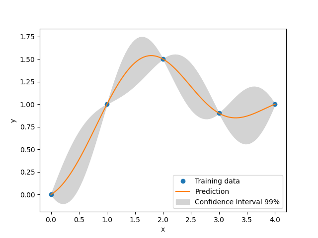
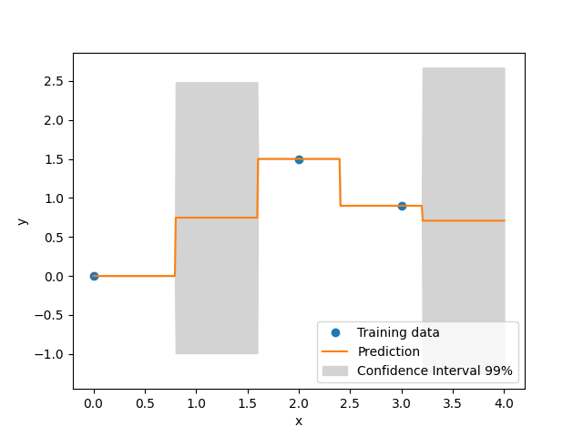

Kriging
=======

Kriging is an interpolating model that is a linear combination of a known function :math:`f_i({\bf x})` which is added to a realization of a stochastic process :math:`Z({\bf x})`

.. math ::
  \hat{y} = \sum\limits_{i=1}^k\beta_if_i({\bf x})+Z({\bf x}).

:math:`Z({\bf x})` is a realization of a stochastic process with mean zero and spatial covariance function given by

.. math ::
  cov\left[Z\left({\bf x}^{(i)}\right),Z\left({\bf x}^{(j)}\right)\right] =\sigma^2R\left({\bf x}^{(i)},{\bf x}^{(j)}\right)
	
where :math:`\sigma^2` is the process variance, and :math:`R` is the correlation.
Four types of correlation functions are available in SMT.

Exponential correlation function (Ornstein-Uhlenbeck process):

.. math ::
  \prod\limits_{l=1}^{nx}\exp\left(-\theta_l\left|x_l^{(i)}-x_l^{(j)}\right|\right),  \quad \forall\ \theta_l\in\mathbb{R}^+
  
Squared Exponential (Gaussian) correlation function:

.. math ::
  \prod\limits_{l=1}^{nx}\exp\left(-\theta_l\left(x_l^{(i)}-x_l^{(j)}\right)^{2}\right),  \quad \forall\ \theta_l\in\mathbb{R}^+
  
Matérn 5/2 correlation function:

.. math ::
  \prod\limits_{l=1}^{nx} \left(1 + \sqrt{5}\theta_{l}\left|x_l^{(i)}-x_l^{(j)}\right| + \frac{5}{3}\theta_{l}^{2}\left(x_l^{(i)}-x_l^{(j)}\right)^{2}\right) \exp\left(-\sqrt{5}\theta_{l}\left|x_l^{(i)}-x_l^{(j)}\right|\right),  \quad \forall\ \theta_l\in\mathbb{R}^+

Matérn 3/2 correlation function:

.. math ::
  \prod\limits_{l=1}^{nx} \left(1 + \sqrt{3}\theta_{l}\left|x_l^{(i)}-x_l^{(j)}\right|\right) \exp\left(-\sqrt{3}\theta_{l}\left|x_l^{(i)}-x_l^{(j)}\right|\right),  \quad \forall\ \theta_l\in\mathbb{R}^+
  
These correlation functions are called by 'abs_exp' (exponential), 'squar_exp' (Gaussian), 'matern52' and 'matern32' in SMT.

The deterministic term :math:`\sum\limits_{i=1}^k\beta_i f_i({\bf x})` can be replaced by a constant, a linear model, or a quadratic model.
These three types are available in SMT.

In the implementations, data are normalized by substracting the mean from each variable (indexed by columns in X), and then dividing the values of each variable by its standard deviation:

.. math ::
  X_{\text{norm}} = \frac{X - X_{\text{mean}}}{X_{\text{std}}}

More details about the Kriging approach could be found in [1]_.

Kriging with categorical or integer variables 
---------------------------------------------

The goal is to be able to build a model for mixed typed variables. 
This algorithm has been presented by  Garrido-Merchán and Hernández-Lobato in 2020 [2]_.

To incorporate integer (with order relation) and categorical variables (with no order), we used continuous relaxation.
For integer, we add a continuous dimension with the same bounds and then we round in the prediction to the closer integer.
For categorical, we add as many continuous dimensions with bounds [0,1] as possible output values for the variable and 
then we round in the prediction to the output dimension giving the greatest continuous prediction.

A special case is the use of the Gower distance to handle mixed integer variables (hence the `gower` kernel/correlation model option).
See the `MixedInteger Tutorial <https://github.com/SMTorg/smt/blob/master/tutorial/SMT_MixedInteger_application.ipynb>`_ for such usage.  

More details available in [2]_. See also :ref:`Mixed-Integer Sampling and Surrogate`.

Implementation Note: Mixed variables handling is available for all Kriging models (KRG, KPLS or KPLSK) but cannot be used with derivatives computation.

.. [1] Sacks, J. and Schiller, S. B. and Welch, W. J., Designs for computer experiments, Technometrics 31 (1) (1989) 41--47.

.. [2] E. C. Garrido-Merchan and D. Hernandez-Lobato, Dealing with categorical and integer-valued variables in Bayesian Optimization with Gaussian processes, Neurocomputing 380 (2020) 20-–35.

Usage
-----

Example 1
^^^^^^^^^^^^^^^^^^^^^^^^^^^^^^

.. code-block:: python

  import numpy as np
  import matplotlib.pyplot as plt
  
  from smt.surrogate_models import KRG
  
  xt = np.array([0.0, 1.0, 2.0, 3.0, 4.0])
  yt = np.array([0.0, 1.0, 1.5, 0.9, 1.0])
  
  sm = KRG(theta0=[1e-2])
  sm.set_training_values(xt, yt)
  sm.train()
  
  num = 100
  x = np.linspace(0.0, 4.0, num)
  y = sm.predict_values(x)
  # estimated variance
  s2 = sm.predict_variances(x)
  # derivative according to the first variable
  dydx = sm.predict_derivatives(xt, 0)
  fig, axs = plt.subplots(1)
  
  # add a plot with variance
  axs.plot(xt, yt, "o")
  axs.plot(x, y)
  axs.fill_between(
      np.ravel(x),
      np.ravel(y - 3 * np.sqrt(s2)),
      np.ravel(y + 3 * np.sqrt(s2)),
      color="lightgrey",
  )
  axs.set_xlabel("x")
  axs.set_ylabel("y")
  axs.legend(
      ["Training data", "Prediction", "Confidence Interval 99%"],
      loc="lower right",
  )
  
  plt.show()
  
::

  ___________________________________________________________________________
     
                                    Kriging
  ___________________________________________________________________________
     
   Problem size
     
        # training points.        : 5
     
  ___________________________________________________________________________
     
   Training
     
     Training ...
     Training - done. Time (sec):  0.0408301
  ___________________________________________________________________________
     
   Evaluation
     
        # eval points. : 100
     
     Predicting ...
     Predicting - done. Time (sec):  0.0000000
     
     Prediction time/pt. (sec) :  0.0000000
     
  ___________________________________________________________________________
     
   Evaluation
     
        # eval points. : 5
     
     Predicting ...
     Predicting - done. Time (sec):  0.0000000
     
     Prediction time/pt. (sec) :  0.0000000
     
  

Example 2 with mixed variables
^^^^^^^^^^^^^^^^^^^^^^^^^^^^^^

.. code-block:: python

  import numpy as np
  import matplotlib.pyplot as plt
  
  from smt.surrogate_models import KRG
  from smt.applications.mixed_integer import MixedIntegerSurrogateModel, ORD
  
  xt = np.array([0.0, 2.0, 3.0])
  yt = np.array([0.0, 1.5, 0.9])
  
  # xtypes = [FLOAT, ORD, (ENUM, 3), (ENUM, 2)]
  # FLOAT means x1 continuous
  # ORD means x2 integer
  # (ENUM, 3) means x3, x4 & x5 are 3 levels of the same categorical variable
  # (ENUM, 2) means x6 & x7 are 2 levels of the same categorical variable
  
  sm = MixedIntegerSurrogateModel(
      xtypes=[ORD], xlimits=[[0, 4]], surrogate=KRG(theta0=[1e-2])
  )
  sm.set_training_values(xt, yt)
  sm.train()
  
  num = 500
  x = np.linspace(0.0, 4.0, num)
  y = sm.predict_values(x)
  # estimated variance
  s2 = sm.predict_variances(x)
  
  fig, axs = plt.subplots(1)
  axs.plot(xt, yt, "o")
  axs.plot(x, y)
  axs.fill_between(
      np.ravel(x),
      np.ravel(y - 3 * np.sqrt(s2)),
      np.ravel(y + 3 * np.sqrt(s2)),
      color="lightgrey",
  )
  axs.set_xlabel("x")
  axs.set_ylabel("y")
  axs.legend(
      ["Training data", "Prediction", "Confidence Interval 99%"],
      loc="lower right",
  )
  
  plt.show()
  
::

  ___________________________________________________________________________
     
   Evaluation
     
        # eval points. : 500
     
     Predicting ...
     Predicting - done. Time (sec):  0.0000000
     
     Prediction time/pt. (sec) :  0.0000000
     
  

Options
-------

.. list-table:: List of options
  :header-rows: 1
  :widths: 15, 10, 20, 20, 30
  :stub-columns: 0

  *  -  Option
     -  Default
     -  Acceptable values
     -  Acceptable types
     -  Description
  *  -  print_global
     -  True
     -  None
     -  ['bool']
     -  Global print toggle. If False, all printing is suppressed
  *  -  print_training
     -  True
     -  None
     -  ['bool']
     -  Whether to print training information
  *  -  print_prediction
     -  True
     -  None
     -  ['bool']
     -  Whether to print prediction information
  *  -  print_problem
     -  True
     -  None
     -  ['bool']
     -  Whether to print problem information
  *  -  print_solver
     -  True
     -  None
     -  ['bool']
     -  Whether to print solver information
  *  -  poly
     -  constant
     -  ['constant', 'linear', 'quadratic']
     -  ['str']
     -  Regression function type
  *  -  corr
     -  squar_exp
     -  ['abs_exp', 'squar_exp', 'matern52', 'matern32']
     -  ['str']
     -  Correlation function type
  *  -  categorical_kernel
     -  None
     -  ['continuous_relaxation_matrix_kernel', 'gower_matrix_kernel', 'exponential_homoscedastic_matrix_kernel', 'homoscedastic_matrix_kernel']
     -  None
     -  The kernel to use for categorical inputs. Only for non continuous Kriging
  *  -  xtypes
     -  None
     -  None
     -  ['list']
     -  x type specifications: either FLOAT for continuous, INT for integer or (ENUM n) for categorical dimension with n levels
  *  -  nugget
     -  2.220446049250313e-14
     -  None
     -  ['float']
     -  a jitter for numerical stability
  *  -  theta0
     -  [0.01]
     -  None
     -  ['list', 'ndarray']
     -  Initial hyperparameters
  *  -  theta_bounds
     -  [1e-06, 20.0]
     -  None
     -  ['list', 'ndarray']
     -  bounds for hyperparameters
  *  -  hyper_opt
     -  Cobyla
     -  ['Cobyla', 'TNC']
     -  ['str']
     -  Optimiser for hyperparameters optimisation
  *  -  eval_noise
     -  False
     -  [True, False]
     -  ['bool']
     -  noise evaluation flag
  *  -  noise0
     -  [0.0]
     -  None
     -  ['list', 'ndarray']
     -  Initial noise hyperparameters
  *  -  noise_bounds
     -  [2.220446049250313e-14, 10000000000.0]
     -  None
     -  ['list', 'ndarray']
     -  bounds for noise hyperparameters
  *  -  use_het_noise
     -  False
     -  [True, False]
     -  ['bool']
     -  heteroscedastic noise evaluation flag
  *  -  n_start
     -  10
     -  None
     -  ['int']
     -  number of optimizer runs (multistart method)
