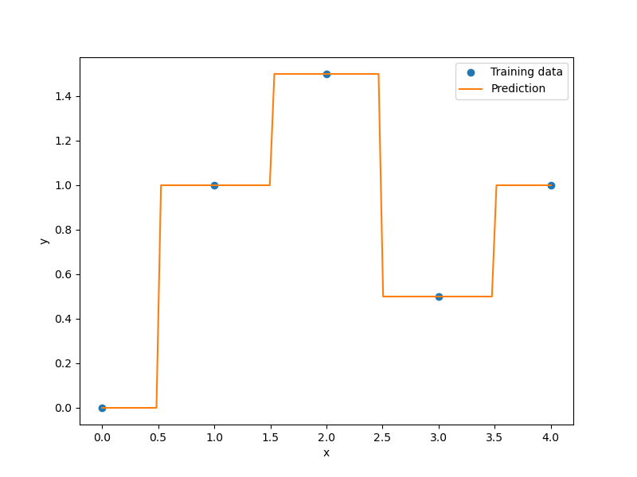

Kriging
=======

Kriging is an interpolating model that is a linear combination of a known function :math:`f_i({\bf x})` which is added to a realization of a stochastic process :math:`Z({\bf x})`

.. math ::
  \hat{y} = \sum\limits_{i=1}^k\beta_if_i({\bf x})+Z({\bf x}).

:math:`Z({\bf x})` is a realization of a stochastique process with mean zero and spatial covariance function given by

.. math ::
  cov\left[Z\left({\bf x}^{(i)}\right),Z\left({\bf x}^{(j)}\right)\right] =\sigma^2R\left({\bf x}^{(i)},{\bf x}^{(j)}\right)

where :math:`\sigma^2` is the process variance, and :math:`R` is the correlation.
Two types of correlation functions are available in SMT: the exponential (Ornstein-Uhlenbeck process) and Gaussian correlation functions

.. math ::
  \prod\limits_{l=1}^{nx}\exp\left(-\theta_l\left|x_l^{(i)}-x_l^{(j)}\right|\right),\qquad \qquad \qquad\prod\limits_{l=1}^{nx}\exp\left(-\theta_l\left(x_l^{(i)}-x_l^{(j)}\right)^{2}\right) \quad \forall\ \theta_l\in\mathbb{R}^+\\
  \text{Exponential correlation function} \quad \qquad\text{Gaussian correlation function}\qquad \qquad

These two correlation functions are called by 'abs_exp' (exponential) and 'squar_exp' (Gaussian) in SMT.

The deterministic term :math:`\sum\limits_{i=1}^k\beta_i f_i({\bf x})` can be replaced by a constant, a linear model, or a quadratic model.
These three types are available in SMT.

More details about the kriging approach could be found in [1]_.

.. [1] Sacks, J. and Schiller, S. B. and Welch, W. J., Designs for computer experiments, Technometrics 31 (1) (1989) 41--47.

Kriging with mixed variables 
^^^^^^^^^^^^^^^^^^^^^^^^^^^^

The goal is to be able to build a model for mixed variables. 
This algorithm has been presented by  Garrido-Merchán and Hernández-Lobato in 2020 [2].

To incorporate integer (with order relation) and categorical variables (with no order), we used continuous relaxation.
For integer, we add a continuous dimension with the same bounds and then we round in the prediction to the closer integer.
For categorical, we add as many continuous dimensions with bounds [0,1] as possible output values for the variable and then we round in the prediction to the output dimension giving the greatest continuous prediction.

More details avalaible here : 

[2] E. C. Garrido-Merchan and D. Hernandez-Lobato. Dealing with categorical and integer-valued variables in Bayesian Optimization with Gaussian processes. In:Neurocomputing 380 (2020), pages 20–35. 

Implementation Note
-------------------

The mixed variables are avalaible for all kriging models like KPLS or KPLSK but not to use with gradient.

Usage
-----

.. code-block:: python

  import numpy as np
  import matplotlib.pyplot as plt
  
  from smt.surrogate_models import KRG
  
  xt = np.array([0.0, 1.0, 2.0, 3.0, 4.0])
  yt = np.array([0.0, 1.0, 1.5, 0.5, 1.0])
  
  sm = KRG(theta0=[1e-2])
  sm.set_training_values(xt, yt)
  sm.train()
  
  num = 100
  x = np.linspace(0.0, 4.0, num)
  y = sm.predict_values(x)
  
  plt.plot(xt, yt, "o")
  plt.plot(x, y)
  plt.xlabel("x")
  plt.ylabel("y")
  plt.legend(["Training data", "Prediction"])
  plt.show()
  
::

  ___________________________________________________________________________
     
                                    Kriging
  ___________________________________________________________________________
     
   Problem size
     
        # training points.        : 5
     
  ___________________________________________________________________________
     
   Training
     
     Training ...
     Training - done. Time (sec):  0.0039978
  ___________________________________________________________________________
     
   Evaluation
     
        # eval points. : 100
     
     Predicting ...
     Predicting - done. Time (sec):  0.0009995
     
     Prediction time/pt. (sec) :  0.0000100
     
  
.. figure:: krg_Test_test_krg.png
  :scale: 80 %
  :align: center

Usage with mixed variables
^^^^^^^^^^^^^^^^^^^^^^^^^^

.. code-block:: python

  import numpy as np
  import matplotlib.pyplot as plt
  
  from smt.surrogate_models import KRG
  
  xt = np.array([0.0, 1.0, 2.0, 3.0, 4.0])
  yt = np.array([0.0, 1.0, 1.5, 0.5, 1.0])
  
  ##    Vartype example
  
  # vartype =["cont","int",("cate",3),("cate",2)]
  #"cont" means x1 continuous
  #"int" means x2 integer
  #"(cate, 3)" means x3,x4 & x5 are 3 levels of the same categorical variable
  #"(cate, 2)" means x6 & x7 are 2 levels of the same categorical variable
  
  vartype = ["int"]     
  sm = KRG(theta0=[1e-2], vartype=vartype)
  sm.set_training_values(xt, yt)
  sm.train()
  
  num = 100
  x = np.linspace(0.0, 4.0, num)
  y = sm.predict_values(x)
  
  plt.plot(xt, yt, "o")
  plt.plot(x, y)
  plt.xlabel("x")
  plt.ylabel("y")
  plt.legend(["Training data", "Prediction"])
  plt.show()
  
::

  ___________________________________________________________________________
     
                                    Kriging
  ___________________________________________________________________________
     
   Problem size
     
        # training points.        : 5
     
  ___________________________________________________________________________
     
   Training
     
     Training ...
     Training - done. Time (sec):  0.0039988
  ___________________________________________________________________________
     
   Evaluation
     
        # eval points. : 100
     
     Predicting ...
     Predicting - done. Time (sec):  0.0009992
     
     Prediction time/pt. (sec) :  0.0000100
     
  

Options
-------

.. list-table:: List of options
  :header-rows: 1
  :widths: 15, 10, 20, 20, 30
  :stub-columns: 0

  *  -  Option
     -  Default
     -  Acceptable values
     -  Acceptable types
     -  Description
  *  -  print_global
     -  True
     -  None
     -  ['bool']
     -  Global print toggle. If False, all printing is suppressed
  *  -  print_training
     -  True
     -  None
     -  ['bool']
     -  Whether to print training information
  *  -  print_prediction
     -  True
     -  None
     -  ['bool']
     -  Whether to print prediction information
  *  -  print_problem
     -  True
     -  None
     -  ['bool']
     -  Whether to print problem information
  *  -  print_solver
     -  True
     -  None
     -  ['bool']
     -  Whether to print solver information
  *  -  vartype
     -  None
     -  None
     -  None
     -  For mixed integer : variables types
  *  -  poly
     -  constant
     -  ['constant', 'linear', 'quadratic']
     -  None
     -  Regression function type
  *  -  corr
     -  squar_exp
     -  ['abs_exp', 'squar_exp']
     -  None
     -  Correlation function type
  *  -  data_dir
     -  None
     -  None
     -  ['str']
     -  Directory for loading / saving cached data; None means do not save or load
  *  -  theta0
     -  [0.01]
     -  None
     -  ['list', 'ndarray']
     -  Initial hyperparameters
