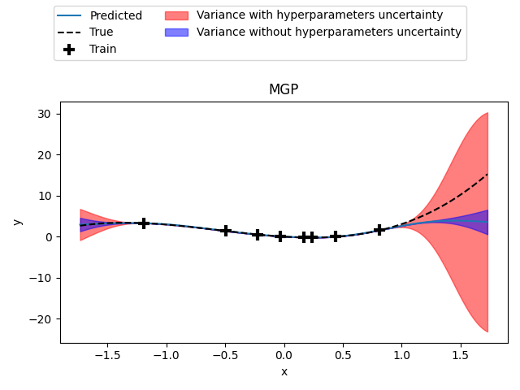

Marginal Gaussian Process (MGP)
===============================

Marginal Gaussian Processes (MGP) are Gaussian Processes taking into account the uncertainty of the 
hyperparameters defined as a density probability function. Especially we suppose that the function
to model :math:`f : \Omega \mapsto \mathbb{R}`, where :math:`\Omega \subset \mathbb{R}^d` and 
:math:`d` is the number of design variables, lies in a linear embedding :math:`\mathcal{A}`
such as :math:`\mathcal{A} = \{ u = Ax, x\in\Omega\}`, :math:`A \in \mathbb{R}^{d \times d_e}`
and :math:`f(x)=f_{\mathcal{A}}(Ax)` with :math:`f(x)=f_{\mathcal{A}} : \mathcal{A} \mapsto \mathbb{R}`
et :math:`d_e \ll d`.

Then, we must use a kernel :math:`k(x,x')=k_{\mathcal{A}}(Ax,Ax')` whose each component of the transfert 
matrix :math:`A` is an hyperparameter. Thus we have :math:`d_e \times d` hyperparameters to find.
(Note that :math:`d_e` is defined as :math:`n\_comp` in the code).

Moreover, we suppose that :math:`A` follows a normal distribution :math:`\mathcal{N}(vect(\hat A),\Sigma)`,
with a mean vector :math:`vect(\hat A)` and a covariance matrix :math:`\Sigma`, which are taken into account in the Gaussian Process building.
Using a Gaussian Process with :math:`\hat A` as hyperparameters and some approximations, 
we obtain the prediction and variance of the MGP considering the normal distribution of :math:`A`.
For more theory on the MGP, refer to [1]_.

.. [1] Garnett, R., Osborne, M. & Hennig, P. Active Learning of Linear Embeddings for Gaussian Processes. In Proceedings of the 30th Conference on Uncertainty in Artificial Intelligence (UAI 2014) 10 (2014).

Limitations
-----------

This implementation only considers a Gaussian kernel.
Moreover, the kernel :math:`k_{\mathcal{A}}` is a uniform Gaussian kernel.
The training of the MGP can be very time consuming.

Usage
-----

.. code-block:: python

  import matplotlib.pyplot as plt
  import numpy as np
  
  from smt.sampling_methods import LHS
  from smt.surrogate_models import MGP
  
  # Construction of the DOE
  dim = 3
  
  def fun(x):
      import numpy as np
  
      res = (
          np.sum(x, axis=1) ** 2
          - np.sum(x, axis=1)
          + 0.2 * (np.sum(x, axis=1) * 1.2) ** 3
      )
      return res
  
  sampling = LHS(
      xlimits=np.asarray([(-1, 1)] * dim), criterion="m", random_state=42
  )
  xt = sampling(8)
  yt = np.atleast_2d(fun(xt)).T
  
  # Build the MGP model
  sm = MGP(
      theta0=[1e-2],
      print_prediction=False,
      n_comp=1,
  )
  sm.set_training_values(xt, yt[:, 0])
  sm.train()
  
  # Get the transfert matrix A
  emb = sm.embedding["C"]
  
  # Compute the smallest box containing all points of A
  upper = np.sum(np.abs(emb), axis=0).item()
  lower = -upper
  
  # Test the model
  u_plot = np.atleast_2d(np.arange(lower, upper, 0.01)).T
  x_plot = sm.get_x_from_u(u_plot)  # Get corresponding points in Omega
  y_plot_true = fun(x_plot)
  y_plot_pred = sm.predict_values(u_plot)
  sigma_MGP = sm.predict_variances(u_plot)
  sigma_KRG = sm.predict_variances_no_uq(u_plot)
  
  u_train = sm.get_u_from_x(xt)  # Get corresponding points in A
  
  # Plots
  fig, ax = plt.subplots()
  ax.plot(u_plot, y_plot_pred, label="Predicted")
  ax.plot(u_plot, y_plot_true, "k--", label="True")
  ax.plot(u_train, yt, "k+", mew=3, ms=10, label="Train")
  ax.fill_between(
      u_plot[:, 0],
      y_plot_pred[:, 0] - 3 * sigma_MGP[:, 0],
      y_plot_pred[:, 0] + 3 * sigma_MGP[:, 0],
      color="r",
      alpha=0.5,
      label="Variance with hyperparameters uncertainty",
  )
  ax.fill_between(
      u_plot[:, 0],
      y_plot_pred[:, 0] - 3 * sigma_KRG[:, 0],
      y_plot_pred[:, 0] + 3 * sigma_KRG[:, 0],
      color="b",
      alpha=0.5,
      label="Variance without hyperparameters uncertainty",
  )
  
  ax.set(xlabel="x", ylabel="y", title="MGP")
  fig.legend(loc="upper center", ncol=2)
  fig.tight_layout()
  fig.subplots_adjust(top=0.74)
  plt.show()
  
::

  ___________________________________________________________________________
     
                                      MGP
  ___________________________________________________________________________
     
   Problem size
     
        # training points.        : 8
     
  ___________________________________________________________________________
     
   Training
     
     Training ...
     Training - done. Time (sec):  0.5737677
  

Options
-------

.. list-table:: List of options
  :header-rows: 1
  :widths: 15, 10, 20, 20, 30
  :stub-columns: 0

  *  -  Option
     -  Default
     -  Acceptable values
     -  Acceptable types
     -  Description
  *  -  print_global
     -  True
     -  None
     -  ['bool']
     -  Global print toggle. If False, all printing is suppressed
  *  -  print_training
     -  True
     -  None
     -  ['bool']
     -  Whether to print training information
  *  -  print_prediction
     -  True
     -  None
     -  ['bool']
     -  Whether to print prediction information
  *  -  print_problem
     -  True
     -  None
     -  ['bool']
     -  Whether to print problem information
  *  -  print_solver
     -  True
     -  None
     -  ['bool']
     -  Whether to print solver information
  *  -  poly
     -  constant
     -  ['constant', 'linear', 'quadratic']
     -  ['str']
     -  Regression function type
  *  -  corr
     -  squar_exp
     -  ['pow_exp', 'abs_exp', 'squar_exp', 'act_exp', 'matern52', 'matern32']
     -  None
     -  Correlation function type
  *  -  pow_exp_power
     -  1.9
     -  None
     -  ['float']
     -  Power for the pow_exp kernel function (valid values in (0.0, 2.0]).                 This option is set automatically when corr option is squar, abs, or matern.
  *  -  categorical_kernel
     -  MixIntKernelType.CONT_RELAX
     -  [<MixIntKernelType.CONT_RELAX: 'CONT_RELAX'>, <MixIntKernelType.GOWER: 'GOWER'>, <MixIntKernelType.EXP_HOMO_HSPHERE: 'EXP_HOMO_HSPHERE'>, <MixIntKernelType.HOMO_HSPHERE: 'HOMO_HSPHERE'>, <MixIntKernelType.COMPOUND_SYMMETRY: 'COMPOUND_SYMMETRY'>]
     -  None
     -  The kernel to use for categorical inputs. Only for non continuous Kriging
  *  -  hierarchical_kernel
     -  MixHrcKernelType.ALG_KERNEL
     -  [<MixHrcKernelType.ALG_KERNEL: 'ALG_KERNEL'>, <MixHrcKernelType.ARC_KERNEL: 'ARC_KERNEL'>]
     -  None
     -  The kernel to use for mixed hierarchical inputs. Only for non continuous Kriging
  *  -  nugget
     -  2.220446049250313e-14
     -  None
     -  ['float']
     -  a jitter for numerical stability
  *  -  theta0
     -  [0.01]
     -  None
     -  ['list', 'ndarray']
     -  Initial hyperparameters
  *  -  theta_bounds
     -  [1e-06, 20.0]
     -  None
     -  ['list', 'ndarray']
     -  bounds for hyperparameters
  *  -  hyper_opt
     -  TNC
     -  ['Cobyla', 'TNC']
     -  ['str']
     -  Optimiser for hyperparameters optimisation
  *  -  eval_noise
     -  False
     -  [True, False]
     -  ['bool']
     -  noise evaluation flag
  *  -  noise0
     -  [0.0]
     -  None
     -  ['list', 'ndarray']
     -  Initial noise hyperparameters
  *  -  noise_bounds
     -  [2.220446049250313e-14, 10000000000.0]
     -  None
     -  ['list', 'ndarray']
     -  bounds for noise hyperparameters
  *  -  use_het_noise
     -  False
     -  [True, False]
     -  ['bool']
     -  heteroscedastic noise evaluation flag
  *  -  n_start
     -  10
     -  None
     -  ['int']
     -  number of optimizer runs (multistart method)
  *  -  xlimits
     -  None
     -  None
     -  ['list', 'ndarray']
     -  definition of a design space of float (continuous) variables: array-like of size nx x 2 (lower, upper bounds)
  *  -  design_space
     -  None
     -  None
     -  ['BaseDesignSpace', 'list', 'ndarray']
     -  definition of the (hierarchical) design space: use `smt.utils.design_space.DesignSpace` as the main API. Also accepts list of float variable bounds
  *  -  random_state
     -  41
     -  None
     -  ['NoneType', 'int', 'RandomState']
     -  Numpy RandomState object or seed number which controls random draws                 for internal optim (set by default to get reproductibility)
  *  -  n_comp
     -  1
     -  None
     -  ['int']
     -  Number of active dimensions
  *  -  prior
     -  {'mean': [0.0], 'var': 1.25}
     -  None
     -  ['dict']
     -  Parameters for Gaussian prior of the Hyperparameters
