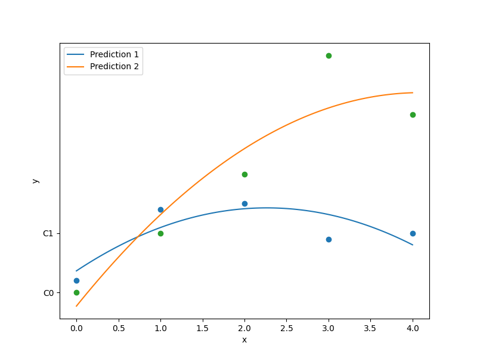

Second-order polynomial approximation
=====================================

The square polynomial model can be expressed by

.. math ::
  {\bf y} = {\bf X\beta} + {\bf \epsilon},

where :math:`{\bf \epsilon}` is a vector of random errors and

.. math ::
  {\bf X} =
  \begin{bmatrix}
      1&x_{1}^{(1)} & \dots&x_{nx}^{(1)} & x_{1}^{(1)}x_{2}^{(1)} & \dots  & x_{nx-1}^{(1)}x_{nx}^{(1)}&{x_{1}^{(1)}}^2 & \dots&{x_{
      nx}^{(1)}}^2 \\
      \vdots&\vdots & \dots&\vdots & \vdots & \dots  & \vdots&\vdots & \vdots\\
      1&x_{1}^{(nt)} & \dots&x_{nx}^{(nt)} & x_{1}^{(nt)}x_{2}^{(nt)} & \dots  & x_{nx-1}^{(nt)}x_{nx}^{(nt)}&{x_{1}^{(nt)}}^2 & \dots&{x_{
      nx}^{(nt)}}^2 \\
  \end{bmatrix}.

The vector of estimated polynomial regression coefficients using ordinary least square estimation is

.. math ::
  {\bf \beta} = {\bf X^TX}^{-1} {\bf X^Ty}.

Usage
-----

.. code-block:: python

  import numpy as np
  import matplotlib.pyplot as plt
  
  from smt.surrogate_models import QP
  
  xt = np.array([[0.0, 1.0, 2.0, 3.0, 4.0]]).T
  yt = np.array([[0.2, 1.4, 1.5, 0.9, 1.0], [0.0, 1.0, 2.0, 4, 3]]).T
  
  sm = QP()
  sm.set_training_values(xt, yt)
  sm.train()
  
  num = 100
  x = np.linspace(0.0, 4.0, num)
  y = sm.predict_values(x)
  
  t1, _ = plt.plot(xt, yt[:, 0], "o", "C0")
  p1 = plt.plot(x, y[:, 0], "C0", label="Prediction 1")
  t2, _ = plt.plot(xt, yt[:, 1], "o", "C1")
  p2 = plt.plot(x, y[:, 1], "C1", label="Prediction 2")
  plt.xlabel("x")
  plt.ylabel("y")
  plt.legend()
  plt.show()
  
::

  ___________________________________________________________________________
     
                                      QP
  ___________________________________________________________________________
     
   Problem size
     
        # training points.        : 5
     
  ___________________________________________________________________________
     
   Training
     
     Training ...
     Training - done. Time (sec):  0.0000000
  ___________________________________________________________________________
     
   Evaluation
     
        # eval points. : 100
     
     Predicting ...
     Predicting - done. Time (sec):  0.0000000
     
     Prediction time/pt. (sec) :  0.0000000
     
  

Options
-------

.. list-table:: List of options
  :header-rows: 1
  :widths: 15, 10, 20, 20, 30
  :stub-columns: 0

  *  -  Option
     -  Default
     -  Acceptable values
     -  Acceptable types
     -  Description
  *  -  print_global
     -  True
     -  None
     -  ['bool']
     -  Global print toggle. If False, all printing is suppressed
  *  -  print_training
     -  True
     -  None
     -  ['bool']
     -  Whether to print training information
  *  -  print_prediction
     -  True
     -  None
     -  ['bool']
     -  Whether to print prediction information
  *  -  print_problem
     -  True
     -  None
     -  ['bool']
     -  Whether to print problem information
  *  -  print_solver
     -  True
     -  None
     -  ['bool']
     -  Whether to print solver information
  *  -  data_dir
     -  None
     -  None
     -  ['str']
     -  Directory for loading / saving cached data; None means do not save or load
