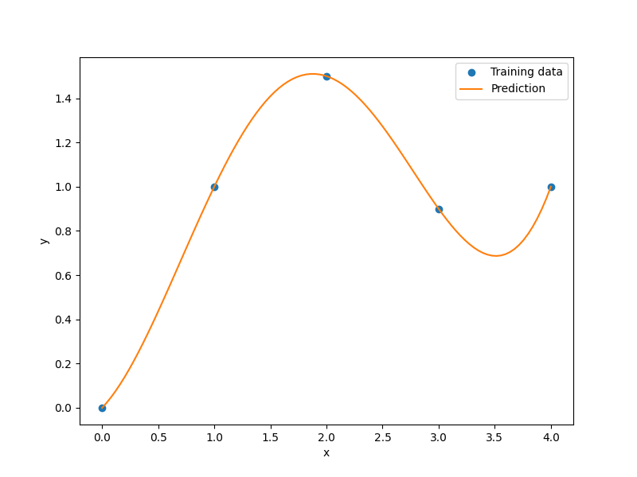

Radial basis functions
======================

The radial basis function (RBF) surrogate model represents the interpolating function
as a linear combination of basis functions, one for each training point.
RBFs are named as such because the basis functions depend only on
the distance from the prediction point to the training point for the basis function.
The coefficients of the basis functions are computed during the training stage.
RBFs are frequently augmented to global polynomials to capture the general trends.

The prediction equation for RBFs is

.. math ::
  y = \mathbf{p}(\mathbf{x}) \mathbf{w_p} + \sum_i^{nt} \phi(\mathbf{x}, \mathbf{xt}_i) \mathbf{w_r} ,

where
:math:`\mathbf{x} \in \mathbb{R}^{nx}` is the prediction input vector,
:math:`y \in \mathbb{R}` is the prediction output,
:math:`\mathbf{xt}_i \in \mathbb{R}^{nx}` is the input vector for the :math:`i` th training point,
:math:`\mathbf{p}(\mathbf{x}) \in \mathbb{R}^{np}` is the vector mapping the polynomial coefficients to the prediction output,
:math:`\phi(\mathbf{x}, \mathbf{xt}_i) \in \mathbb{R}^{nt}` is the vector mapping the radial basis function coefficients to the prediction output,
:math:`\mathbf{w_p} \in \mathbb{R}^{np}` is the vector of polynomial coefficients,
and
:math:`\mathbf{w_r} \in \mathbb{R}^{nt}` is the vector of radial basis function coefficients.

The coefficients, :math:`\mathbf{w_p}` and :math:`\mathbf{w_r}`, are computed by solving the follow linear system:

.. math ::

  \begin{bmatrix}
    \phi( \mathbf{xt}_1 , \mathbf{xt}_1 ) & \dots & \phi( \mathbf{xt}_1 , \mathbf{xt}_{nt} ) & \mathbf{p}(\mathbf{xt}_1) ^ T \\
    \vdots & \ddots & \vdots & \vdots \\
    \phi( \mathbf{xt}_{nt} , \mathbf{xt}_1 ) & \dots & \phi( \mathbf{xt}_{nt} , \mathbf{xt}_{nt} ) & \mathbf{p}( \mathbf{xt}_{nt} ) ^ T \\
    \mathbf{p}( \mathbf{xt}_1 ) & \dots & \mathbf{p}( \mathbf{xt}_{nt} ) & \mathbf{0} \\
  \end{bmatrix}
  \begin{bmatrix}
    \mathbf{w_r}_1 \\
    \vdots \\
    \mathbf{w_r}_{nt} \\
    \mathbf{w_p} \\
  \end{bmatrix}
  =
  \begin{bmatrix}
    yt_1 \\
    \vdots \\
    yt_{nt} \\
    0 \\
  \end{bmatrix}

Only Gaussian basis functions are currently implemented.
These are given by:

.. math ::

  \phi( \mathbf{x}_i , \mathbf{x}_j ) = \exp \left( \frac{|| \mathbf{x}_i - \mathbf{x}_j ||_2 ^ 2}{d0^2} \right)

Usage
-----

.. code-block:: python

  import numpy as np
  import matplotlib.pyplot as plt
  
  from smt.surrogate_models import RBF
  
  xt = np.array([0.0, 1.0, 2.0, 3.0, 4.0])
  yt = np.array([0.0, 1.0, 1.5, 0.9, 1.0])
  
  sm = RBF(d0=5)
  sm.set_training_values(xt, yt)
  sm.train()
  
  num = 100
  x = np.linspace(0.0, 4.0, num)
  y = sm.predict_values(x)
  
  plt.plot(xt, yt, "o")
  plt.plot(x, y)
  plt.xlabel("x")
  plt.ylabel("y")
  plt.legend(["Training data", "Prediction"])
  plt.show()
  
::

  ___________________________________________________________________________
     
                                      RBF
  ___________________________________________________________________________
     
   Problem size
     
        # training points.        : 5
     
  ___________________________________________________________________________
     
   Training
     
     Training ...
        Initializing linear solver ...
           Performing LU fact. (5 x 5 mtx) ...
           Performing LU fact. (5 x 5 mtx) - done. Time (sec):  0.0000000
        Initializing linear solver - done. Time (sec):  0.0000000
        Solving linear system (col. 0) ...
           Back solving (5 x 5 mtx) ...
           Back solving (5 x 5 mtx) - done. Time (sec):  0.0000000
        Solving linear system (col. 0) - done. Time (sec):  0.0000000
     Training - done. Time (sec):  0.0000000
  ___________________________________________________________________________
     
   Evaluation
     
        # eval points. : 100
     
     Predicting ...
     Predicting - done. Time (sec):  0.0000000
     
     Prediction time/pt. (sec) :  0.0000000
     
  

Options
-------

.. list-table:: List of options
  :header-rows: 1
  :widths: 15, 10, 20, 20, 30
  :stub-columns: 0

  *  -  Option
     -  Default
     -  Acceptable values
     -  Acceptable types
     -  Description
  *  -  print_global
     -  True
     -  None
     -  ['bool']
     -  Global print toggle. If False, all printing is suppressed
  *  -  print_training
     -  True
     -  None
     -  ['bool']
     -  Whether to print training information
  *  -  print_prediction
     -  True
     -  None
     -  ['bool']
     -  Whether to print prediction information
  *  -  print_problem
     -  True
     -  None
     -  ['bool']
     -  Whether to print problem information
  *  -  print_solver
     -  True
     -  None
     -  ['bool']
     -  Whether to print solver information
  *  -  d0
     -  1.0
     -  None
     -  ['int', 'float', 'list', 'ndarray']
     -  basis function scaling parameter in exp(-d^2 / d0^2)
  *  -  poly_degree
     -  -1
     -  [-1, 0, 1]
     -  ['int']
     -  -1 means no global polynomial, 0 means constant, 1 means linear trend
  *  -  data_dir
     -  None
     -  None
     -  ['str']
     -  Directory for loading / saving cached data; None means do not save or load
  *  -  reg
     -  1e-10
     -  None
     -  ['int', 'float']
     -  Regularization coeff.
  *  -  max_print_depth
     -  5
     -  None
     -  ['int']
     -  Maximum depth (level of nesting) to print operation descriptions and times
