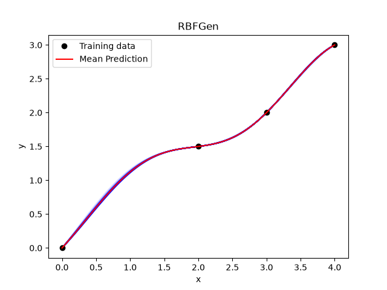
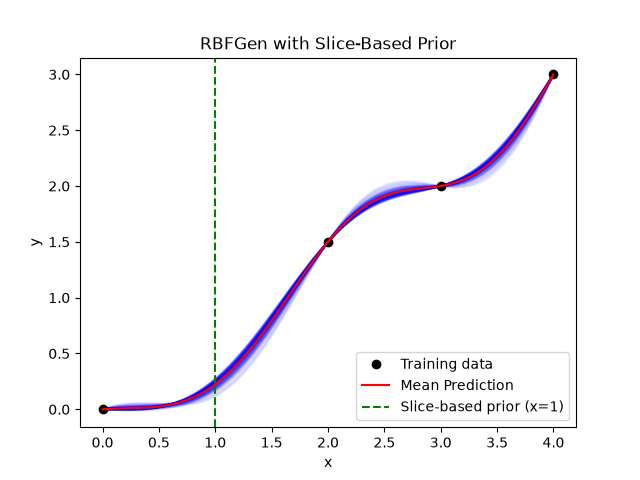

Knowledge-enhanced radial basis functions
=========================================

The effectiveness of surrogate models is often limited by data scarcity. One way to improve the performance of such surrogate models is by leveraging domain-specific knowledge to guide model predictions. RBF-Gen [1]_ is a radial basis function (RBF)-based generative model that allows for the integration of domain-specific knowledge in surrogate models without affecting data interpolation. First an RBF model is constructed

.. math ::
  y = \sum_i^{K} \phi(\mathbf{x}, \mathbf{xf}_i) w_i ,

where
:math:`\mathbf{x} \in \mathbb{R}^{n_x}` is the prediction input vector,
:math:`y \in \mathbb{R}` is the prediction output,
:math:`\phi(\mathbf{x}, \mathbf{xf}_i) \in \mathbb{R}` is a radial basis function kernel,
:math:`\mathbf{xf}_i \in \mathbb{R}^{nx}` is the location of the center of the :math:`i` th radial kernel, and
:math:`w_i \in \mathbb{R}` are the radial basis function coefficients. Enforcing interpolation of :math:`nt` data points :math:`\mathbf{yt}_i \in \mathbb{R}` at corresponding input vectors :math:`\mathbf{xt}_i \in \mathbb{R}^{nx}` with :math:`K` radial kernels results in the following linear system,

.. math ::

  \underbrace{\begin{bmatrix}
    \phi( \mathbf{xt}_1 , \mathbf{xf}_1 ) & \dots & \phi( \mathbf{xt}_1 , \mathbf{xf}_{K} ) \\
    \vdots & \ddots & \vdots \\
    \phi( \mathbf{xt}_{nt} , \mathbf{xf}_1 ) & \dots & \phi( \mathbf{xt}_{nt} , \mathbf{xf}_{K} ) \\
  \end{bmatrix}
  \begin{bmatrix}
    \mathbf{w}_1 \\
    \vdots \\
    \mathbf{w}_{K} \\
  \end{bmatrix}}_{= \Phi}
  =
  \begin{bmatrix}
    yt_1 \\
    \vdots \\
    yt_{nt} \\
  \end{bmatrix},

where :math:`\Phi \in \mathbb{R}^{nt \times K}`. For :math:`K > nt` this system is underdetermined and does not have a unique solution. We use a least-squares approach to compute the minimum-norm solution :math:`\mathbf{w}_0`, 

.. math ::

  \mathbf{w}_0 = 
  \left(\Phi^T \Phi \right)^{-1} \Phi^T 
  \begin{bmatrix}
  yt_1 \\
  \vdots \\
  yt_{nt} \\
  \end{bmatrix},

and compute an orthonormal basis :math:`N \in \mathbb{R}^{K \times K - nt}` for the nullspace of :math:`\Phi`. 

The radial basis function weight vector :math:`\mathbf{w} = \mathbf{w}_0 + N \mathbf{\alpha}`, with :math:`\mathbf{\alpha} \in \mathbb{R}^{K-nt}`, interpolates the given data points for any :math:`\mathbf{\alpha}`. We train a neural network generator :math:`G` to map latent variables :math:`z \sim \mathcal{N}(0, 1)^d`, with :math:`d` the dimension of the latent space, into coefficient vectors :math:`\mathbf{\alpha}`, such that the interpolant with the resultant weight vector :math:`\mathbf{w} = \mathbf{w}_0 + N \mathbf{\alpha}` is consistent with domain-specific knowledge. To this end, the generator :math:`G` is trained to minimize one or more loss terms. Every training epoch we sample a batch of latent variables :math:`z \sim \mathcal{N}(0, 1)^d`. Several types of loss terms are implemented in SMT: 

* Monotonicity: We know that the underlying model increases (decreases) monotonically under input changes, and therefore penalize negative (positive) derivatives.  

* Positivity: We know that the output quantity is always positive, and therefore penalize negative output values.

* Slice-based priors: We know the output mean and standard deviation in one or more points, for example from experimental data. We therefore penalize deviations from this imposed output mean and standard deviation of the batch of outputs :math:`\mathbf{w} = \mathbf{w}_0 + N \mathbf{\alpha}(z)`.

A base `LossTerm` class is available, which can be used to create custom loss terms. A non-exhaustive list of examples can be found in [1]_.

.. [1] Wang, B., Jeong, S., van Schie, S. P. C., Han, D., Min, J., and Hwang, J. T., Knowledge-Guided Generative Surrogate Modeling for High-Dimensional Design Optimization under Scarce Data, ASME J. Comput. Inf. Sci. Eng, 2026, https://doi.org/10.1115/1.4070934.

Usage
-----

Example 1, with monotonicity and positivity constraints
^^^^^^^^^^^^^^^^^^^^^^^^^^^^^^^^^^^^^^^^^^^^^^^^^^^^^^^

.. code-block:: python

  from smt.surrogate_models.rbfgen import RBFGEN_AVAILABLE
  import matplotlib.pyplot as plt
  import numpy as np

  from smt.surrogate_models import RBFGen
  from smt.utils.nn_lossterms import MonotonicityLossTerm, PositivityLossTerm
  from smt.utils.nn_rich_rbf import rbf_features

  if RBFGEN_AVAILABLE:
      xt = np.array([[0.0], [2.0], [3.0], [4.0]])
      yt = np.array([[0.0], [1.5], [2.0], [3.0]])

      sm = RBFGen(epochs=1000, learning_rate=5e-2, rbf_m_centers=50)
      sm.set_training_values(xt, yt)

      sm.add_loss_term(MonotonicityLossTerm(x_train=xt, random_base_points=True))
      sm.add_loss_term(PositivityLossTerm(x_train=xt))

      sm.train()

      num = 100
      x = np.linspace(0.0, 4.0, num).reshape(-1, 1)
      y = sm.predict_values(x)
      s2 = sm.predict_variances(x)
      s2 = s2[:, 0]

      plt.figure()
      rbf = sm.options["rbf_surrogate"]
      Phi_q = rbf_features(x, rbf.rbf_centers, rbf.d0)
      y_ensemble = sm.network_weights @ Phi_q.T
      for i in range(y_ensemble.shape[0]):
          plt.plot(x, y_ensemble[i, :], alpha=0.05, color='blue')
      plt.plot(xt, yt, "o", color='black', label="Training data")
      plt.plot(x, y, color='red', label="Mean Prediction")
      plt.xlabel("x")
      plt.ylabel("y")
      plt.title("RBFGen")
      plt.legend()
      plt.show()
  
::

  ___________________________________________________________________________
   
                                    RBFGen
  ___________________________________________________________________________
   
   Problem size
   
        # training points.        : 4
   
  ___________________________________________________________________________
   
   Training
   
     Training ...
  ___________________________________________________________________________
   
                                   NNRichRBF
  ___________________________________________________________________________
   
   Problem size
   
        # training points.        : 4
   
  ___________________________________________________________________________
   
   Training
   
     Training ...
     Training - done. Time (sec):  0.0012760
  Epoch   100/500 | Total Loss: 9.6284e-05 | MonotonicityLossTerm: 8.6200e-11 | PositivityLossTerm: 9.6284e-05
  Epoch   200/500 | Total Loss: 9.5670e-05 | MonotonicityLossTerm: 9.7880e-11 | PositivityLossTerm: 9.5670e-05
  Epoch   300/500 | Total Loss: 9.5816e-05 | MonotonicityLossTerm: 1.3220e-10 | PositivityLossTerm: 9.5816e-05
  Epoch   400/500 | Total Loss: 9.5633e-05 | MonotonicityLossTerm: 1.7539e-10 | PositivityLossTerm: 9.5633e-05
  Epoch   500/500 | Total Loss: 9.5242e-05 | MonotonicityLossTerm: 2.5682e-10 | PositivityLossTerm: 9.5242e-05
     Training - done. Time (sec):  1.1074991
  ___________________________________________________________________________
   
   Evaluation
   
        # eval points. : 100
   
     Predicting ...
     Predicting - done. Time (sec):  0.0002801
   
     Prediction time/pt. (sec) :  0.0000028
   
  ___________________________________________________________________________
   
   Evaluation
   
        # eval points. : 100
   
     Predicting ...
     Predicting - done. Time (sec):  0.0001576
   
     Prediction time/pt. (sec) :  0.0000016
     
  

Example 2, with monotonicity, positivity and slice-based prior loss terms
^^^^^^^^^^^^^^^^^^^^^^^^^^^^^^^^^^^^^^^^^^^^^^^^^^^^^^^^^^^^^^^^^^^^^^^^

.. code-block:: python

  from smt.surrogate_models.rbfgen import RBFGEN_AVAILABLE
  import matplotlib.pyplot as plt
  import numpy as np

  from smt.surrogate_models import RBFGen
  from smt.utils.nn_lossterms import MonotonicityLossTerm, PositivityLossTerm, SliceBasedPriorLossTerm
  from smt.utils.nn_rich_rbf import rbf_features

  if RBFGEN_AVAILABLE:
      xt = np.array([[0.0], [2.0], [3.0], [4.0]])
      yt = np.array([[0.0], [1.5], [2.0], [3.0]])

      prior_points = np.array([[1.0]])
      prior_means = np.array([0.2])
      prior_stds = np.array([0.05])

      sm = RBFGen(epochs=1000, learning_rate=5e-2, rbf_m_centers=50)
      sm.set_training_values(xt, yt)

      sm.add_loss_term(MonotonicityLossTerm(x_train=xt, random_base_points=True))
      sm.add_loss_term(PositivityLossTerm(x_train=xt))

      sm.add_loss_term(SliceBasedPriorLossTerm(x_train=xt, prior_points=prior_points, prior_means=prior_means, prior_stds=prior_stds, loss_term_weight=1.))
      sm.train()

      num = 100
      x = np.linspace(0.0, 4.0, num).reshape(-1, 1)
      y = sm.predict_values(x)
      s2 = sm.predict_variances(x)
      s2 = s2[:, 0]

      plt.figure()
      rbf = sm.options["rbf_surrogate"]
      Phi_q = rbf_features(x, rbf.rbf_centers, rbf.d0)
      y_ensemble = sm.network_weights @ Phi_q.T
      for i in range(y_ensemble.shape[0]):
          plt.plot(x, y_ensemble[i, :], alpha=0.05, color='blue')
      plt.plot(xt, yt, "o", color='black', label="Training data")
      plt.plot(x, y, color='red', label="Mean Prediction")
      plt.axvline(1.0, color='green', linestyle='--', label="Slice-based prior (x=1)")
      plt.xlabel("x")
      plt.ylabel("y")
      plt.title("RBFGen with Slice-Based Prior")
      plt.legend()
      plt.show()

::

  ___________________________________________________________________________
   
                                    RBFGen
  ___________________________________________________________________________
   
   Problem size
   
        # training points.        : 4
   
  ___________________________________________________________________________
   
   Training
   
     Training ...
  ___________________________________________________________________________
   
                                   NNRichRBF
  ___________________________________________________________________________
   
   Problem size
   
        # training points.        : 4
   
  ___________________________________________________________________________
   
   Training
   
     Training ...
     Training - done. Time (sec):  0.0012794
  Epoch   100/1000 | Total Loss: 1.1156e-02 | MonotonicityLossTerm: 8.5115e-15 | PositivityLossTerm: 9.5316e-03 | SliceBasedPriorLossTerm: 1.6245e-03
  Epoch   200/1000 | Total Loss: 1.0257e-02 | MonotonicityLossTerm: 1.1536e-13 | PositivityLossTerm: 8.5492e-03 | SliceBasedPriorLossTerm: 1.7075e-03
  Epoch   300/1000 | Total Loss: 9.1635e-03 | MonotonicityLossTerm: 4.8187e-14 | PositivityLossTerm: 7.5699e-03 | SliceBasedPriorLossTerm: 1.5936e-03
  Epoch   400/1000 | Total Loss: 7.7977e-03 | MonotonicityLossTerm: 9.1851e-14 | PositivityLossTerm: 6.3744e-03 | SliceBasedPriorLossTerm: 1.4234e-03
  Epoch   500/1000 | Total Loss: 5.9947e-03 | MonotonicityLossTerm: 3.1715e-10 | PositivityLossTerm: 4.3859e-03 | SliceBasedPriorLossTerm: 1.6088e-03
  Epoch   600/1000 | Total Loss: 3.6352e-03 | MonotonicityLossTerm: 1.2038e-07 | PositivityLossTerm: 2.9237e-03 | SliceBasedPriorLossTerm: 7.1142e-04
  Epoch   700/1000 | Total Loss: 1.7989e-03 | MonotonicityLossTerm: 3.8805e-05 | PositivityLossTerm: 1.3541e-03 | SliceBasedPriorLossTerm: 4.0602e-04
  Epoch   800/1000 | Total Loss: 1.1258e-03 | MonotonicityLossTerm: 7.8219e-05 | PositivityLossTerm: 6.2071e-04 | SliceBasedPriorLossTerm: 4.2691e-04
  Epoch   900/1000 | Total Loss: 1.0009e-03 | MonotonicityLossTerm: 1.3448e-05 | PositivityLossTerm: 5.8774e-04 | SliceBasedPriorLossTerm: 3.9967e-04
  Epoch  1000/1000 | Total Loss: 1.1003e-03 | MonotonicityLossTerm: 4.2802e-04 | PositivityLossTerm: 4.7839e-04 | SliceBasedPriorLossTerm: 1.9392e-04
     Training - done. Time (sec):  1.9414334
  ___________________________________________________________________________
   
   Evaluation
   
        # eval points. : 100
   
     Predicting ...
     Predicting - done. Time (sec):  0.0002983
   
     Prediction time/pt. (sec) :  0.0000030
   
  ___________________________________________________________________________
   
   Evaluation
   
        # eval points. : 100
   
     Predicting ...
     Predicting - done. Time (sec):  0.0001428
   
     Prediction time/pt. (sec) :  0.0000014

Options
-------

.. list-table:: List of options
  :header-rows: 1
  :widths: 15, 10, 20, 20, 30
  :stub-columns: 0

  *  -  Option
     -  Default
     -  Acceptable values
     -  Acceptable types
     -  Description
  *  -  print_global
     -  True
     -  None
     -  ['bool']
     -  Global print toggle. If False, all printing is suppressed
  *  -  print_training
     -  True
     -  None
     -  ['bool']
     -  Whether to print training information
  *  -  print_prediction
     -  True
     -  None
     -  ['bool']
     -  Whether to print prediction information
  *  -  print_problem
     -  True
     -  None
     -  ['bool']
     -  Whether to print problem information
  *  -  print_solver
     -  True
     -  None
     -  ['bool']
     -  Whether to print solver information
  *  -  d0
     -  1.0
     -  None
     -  ['int', 'float', 'list', 'ndarray']
     -  basis function scaling parameter in exp(-d^2 / d0^2)
  *  -  poly_degree
     -  -1
     -  [-1, 0, 1]
     -  ['int']
     -  -1 means no global polynomial, 0 means constant, 1 means linear trend
  *  -  data_dir
     -  None
     -  None
     -  ['str']
     -  Directory for loading / saving cached data; None means do not save or load
  *  -  reg
     -  1e-10
     -  None
     -  ['int', 'float']
     -  Regularization coeff.
  *  -  max_print_depth
     -  5
     -  None
     -  ['int']
     -  Maximum depth (level of nesting) to print operation descriptions and times
