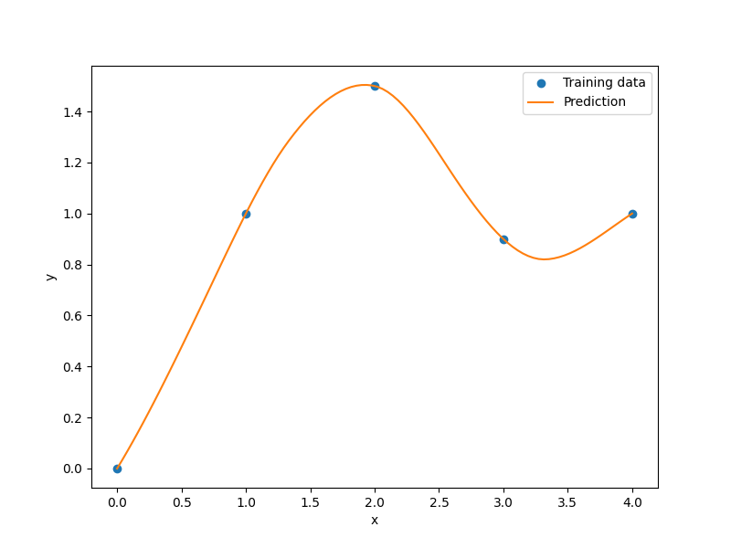

Regularized minimal-energy tensor-product splines
=================================================

Regularized minimal-energy tensor-product splines (RMTS) is a type of surrogate model for
low-dimensional problems with large datasets and where fast prediction is desired.
The underlying mathematical functions are tensor-product splines,
which limits RMTS to up to 4-D problems, or 5-D problems in certain cases.
On the other hand, tensor-product splines enable a very fast prediction time
that does not increase with the number of training points.
Unlike other methods like Kriging and radial basis functions,
RMTS is not susceptible to numerical issues when there is a large number of training points
or when there are points that are too close together.

The prediction equation for RMTS is

.. math ::
  y = \mathbf{F}(\mathbf{x}) \mathbf{w} ,

where
:math:`\mathbf{x} \in \mathbb{R}^{nx}` is the prediction input vector,
:math:`y \in \mathbb{R}` is the prediction output,
:math:`\mathbf{w} \in \mathbb{R}^{nw}` is the vector of spline coefficients,
and
:math:`\mathbf{F}(\mathbf{x}) \in \mathbb{R}^{nw}` is the vector mapping the spline coefficients to the prediction output.

RMTS computes the coefficients of the splines, :math:`\mathbf{w}`, by solving an energy minimization problem
subject to the conditions that the splines pass through the training points.
This is formulated as an unconstrained optimization problem
where the objective function consists of a term containing the second derivatives of the splines,
another term representing the approximation error for the training points,
and another term for regularization:

.. math ::

  \begin{array}{r l}
    \underset{\mathbf{w}}{\min} & \frac{1}{2} \mathbf{w}^T \mathbf{H} \mathbf{w}
    + \frac{1}{2} \beta \mathbf{w}^T \mathbf{w}
    \\
    &
    + \frac{1}{2} \frac{1}{\alpha}
    \sum_i^{nt} \left[ \mathbf{F}(\mathbf{xt}_i) \mathbf{w} - yt_i \right] ^ 2
  \end{array} ,

where
:math:`\mathbf{xt}_i \in \mathbb{R}^{nx}` is the input vector for the :math:`i` th training point,
:math:`yt_i \in \mathbb{R}` is the output value for the :math:`i` th training point,
:math:`\mathbf{H} \in \mathbb{R}^{nw \times nw}` is the matrix containing the second derivatives,
:math:`\mathbf{F}(\mathbf{xt}_i) \in \mathbb{R}^{nw}` is the vector mapping the spline coefficients to the :math:`i` th training output,
and :math:`\alpha` and :math:`\beta` are regularization coefficients.

In problems with a large number of training points relative to the number of spline coefficients,
the energy minimization term is not necessary;
this term can be zero-ed by setting the reg_cons option to zero.
In problems with a small dataset, the energy minimization is necessary.
When the true function has high curvature, the energy minimization can be counterproductive
in the regions of high curvature.
This can be addressed by increasing the quadratic approximation term to one of higher order,
and using Newton's method to solve the nonlinear system that results.
The nonlinear formulation is given by

.. math::

  \begin{array}{r l}
    \underset{\mathbf{w}}{\min} & \frac{1}{2} \mathbf{w}^T \mathbf{H} \mathbf{w}
    + \frac{1}{2} \beta \mathbf{w}^T \mathbf{w}
    \\
    &
    + \frac{1}{2} \frac{1}{\alpha}
    \sum_i^{nt} \left[ \mathbf{F}(\mathbf{xt}_i) \mathbf{w} - yt_i \right] ^ p
  \end{array}
  ,

where :math:`p` is the order given by the approx_order option.
The number of Newton iterations can be specified via the :code:`nonlinear_maxiter` option.

RMTS is implemented in SMT with two choices of splines:

1. B-splines (RMTB): RMTB uses B-splines with a uniform knot vector in each dimension.
The number of B-spline control points and the B-spline order in each dimension are options
that trade off efficiency and precision of the interpolant.

2. Cubic Hermite splines (RMTC): RMTC divides the domain into tensor-product cubic elements.
For adjacent elements, the values and derivatives are continuous.
The number of elements in each dimension is an option that trades off efficiency and precision.

In general, RMTB is the better choice when training time is the most important,
while RMTC is the better choice when accuracy of the interpolant is the most important.
More details of these methods are given in [1]_.

.. [1] Hwang, J. T., & Martins, J. R. (2018). A fast-prediction surrogate model for large datasets. Aerospace Science and Technology, 75, 74-87.

Usage (RMTB)
------------

.. code-block:: python

  import numpy as np
  import matplotlib.pyplot as plt
  
  from smt.surrogate_models import RMTB
  
  xt = np.array([0.0, 1.0, 2.0, 3.0, 4.0])
  yt = np.array([0.0, 1.0, 1.5, 0.9, 1.0])
  
  xlimits = np.array([[0.0, 4.0]])
  
  sm = RMTB(
      xlimits=xlimits,
      order=4,
      num_ctrl_pts=20,
      energy_weight=1e-15,
      regularization_weight=0.0,
  )
  sm.set_training_values(xt, yt)
  sm.train()
  
  num = 100
  x = np.linspace(0.0, 4.0, num)
  y = sm.predict_values(x)
  
  plt.plot(xt, yt, "o")
  plt.plot(x, y)
  plt.xlabel("x")
  plt.ylabel("y")
  plt.legend(["Training data", "Prediction"])
  plt.show()
  
::

  ___________________________________________________________________________
     
                                     RMTB
  ___________________________________________________________________________
     
   Problem size
     
        # training points.        : 5
     
  ___________________________________________________________________________
     
   Training
     
     Training ...
        Pre-computing matrices ...
           Computing dof2coeff ...
           Computing dof2coeff - done. Time (sec):  0.0000000
           Initializing Hessian ...
           Initializing Hessian - done. Time (sec):  0.0000000
           Computing energy terms ...
           Computing energy terms - done. Time (sec):  0.0000000
           Computing approximation terms ...
           Computing approximation terms - done. Time (sec):  0.0000000
        Pre-computing matrices - done. Time (sec):  0.0000000
        Solving for degrees of freedom ...
           Solving initial startup problem (n=20) ...
              Solving for output 0 ...
                 Iteration (num., iy, grad. norm, func.) :   0   0 1.549745600e+00 2.530000000e+00
                 Iteration (num., iy, grad. norm, func.) :   0   0 1.395101781e-15 4.464186103e-16
              Solving for output 0 - done. Time (sec):  0.0100002
           Solving initial startup problem (n=20) - done. Time (sec):  0.0100002
           Solving nonlinear problem (n=20) ...
              Solving for output 0 ...
                 Iteration (num., iy, grad. norm, func.) :   0   0 1.531354982e-15 4.464186103e-16
              Solving for output 0 - done. Time (sec):  0.0000000
           Solving nonlinear problem (n=20) - done. Time (sec):  0.0000000
        Solving for degrees of freedom - done. Time (sec):  0.0100002
     Training - done. Time (sec):  0.0100002
  ___________________________________________________________________________
     
   Evaluation
     
        # eval points. : 100
     
     Predicting ...
     Predicting - done. Time (sec):  0.0000000
     
     Prediction time/pt. (sec) :  0.0000000
     
  

Usage (RMTC)
------------

.. code-block:: python

  import numpy as np
  import matplotlib.pyplot as plt
  
  from smt.surrogate_models import RMTC
  
  xt = np.array([0.0, 1.0, 2.0, 3.0, 4.0])
  yt = np.array([0.0, 1.0, 1.5, 0.9, 1.0])
  
  xlimits = np.array([[0.0, 4.0]])
  
  sm = RMTC(
      xlimits=xlimits,
      num_elements=20,
      energy_weight=1e-15,
      regularization_weight=0.0,
  )
  sm.set_training_values(xt, yt)
  sm.train()
  
  num = 100
  x = np.linspace(0.0, 4.0, num)
  y = sm.predict_values(x)
  
  plt.plot(xt, yt, "o")
  plt.plot(x, y)
  plt.xlabel("x")
  plt.ylabel("y")
  plt.legend(["Training data", "Prediction"])
  plt.show()
  
::

  ___________________________________________________________________________
     
                                     RMTC
  ___________________________________________________________________________
     
   Problem size
     
        # training points.        : 5
     
  ___________________________________________________________________________
     
   Training
     
     Training ...
        Pre-computing matrices ...
           Computing dof2coeff ...
           Computing dof2coeff - done. Time (sec):  0.0099998
           Initializing Hessian ...
           Initializing Hessian - done. Time (sec):  0.0000000
           Computing energy terms ...
           Computing energy terms - done. Time (sec):  0.0000000
           Computing approximation terms ...
           Computing approximation terms - done. Time (sec):  0.0000000
        Pre-computing matrices - done. Time (sec):  0.0099998
        Solving for degrees of freedom ...
           Solving initial startup problem (n=42) ...
              Solving for output 0 ...
                 Iteration (num., iy, grad. norm, func.) :   0   0 2.249444376e+00 2.530000000e+00
                 Iteration (num., iy, grad. norm, func.) :   0   0 2.004900347e-15 4.346868680e-16
              Solving for output 0 - done. Time (sec):  0.0000000
           Solving initial startup problem (n=42) - done. Time (sec):  0.0000000
           Solving nonlinear problem (n=42) ...
              Solving for output 0 ...
                 Iteration (num., iy, grad. norm, func.) :   0   0 2.956393318e-15 4.346868680e-16
              Solving for output 0 - done. Time (sec):  0.0000000
           Solving nonlinear problem (n=42) - done. Time (sec):  0.0000000
        Solving for degrees of freedom - done. Time (sec):  0.0000000
     Training - done. Time (sec):  0.0099998
  ___________________________________________________________________________
     
   Evaluation
     
        # eval points. : 100
     
     Predicting ...
     Predicting - done. Time (sec):  0.0000000
     
     Prediction time/pt. (sec) :  0.0000000
     
  

Options (RMTB)
--------------

.. list-table:: List of options
  :header-rows: 1
  :widths: 15, 10, 20, 20, 30
  :stub-columns: 0

  *  -  Option
     -  Default
     -  Acceptable values
     -  Acceptable types
     -  Description
  *  -  print_global
     -  True
     -  None
     -  ['bool']
     -  Global print toggle. If False, all printing is suppressed
  *  -  print_training
     -  True
     -  None
     -  ['bool']
     -  Whether to print training information
  *  -  print_prediction
     -  True
     -  None
     -  ['bool']
     -  Whether to print prediction information
  *  -  print_problem
     -  True
     -  None
     -  ['bool']
     -  Whether to print problem information
  *  -  print_solver
     -  True
     -  None
     -  ['bool']
     -  Whether to print solver information
  *  -  xlimits
     -  None
     -  None
     -  ['ndarray']
     -  Lower/upper bounds in each dimension - ndarray [nx, 2]
  *  -  smoothness
     -  1.0
     -  None
     -  ['Integral', 'float', 'tuple', 'list', 'ndarray']
     -  Smoothness parameter in each dimension - length nx. None implies uniform
  *  -  regularization_weight
     -  1e-14
     -  None
     -  ['Integral', 'float']
     -  Weight of the term penalizing the norm of the spline coefficients. This is useful as an alternative to energy minimization  when energy minimization makes the training time too long.
  *  -  energy_weight
     -  0.0001
     -  None
     -  ['Integral', 'float']
     -  The weight of the energy minimization terms
  *  -  extrapolate
     -  False
     -  None
     -  ['bool']
     -  Whether to perform linear extrapolation for external evaluation points
  *  -  min_energy
     -  True
     -  None
     -  ['bool']
     -  Whether to perform energy minimization
  *  -  approx_order
     -  4
     -  None
     -  ['Integral']
     -  Exponent in the approximation term
  *  -  solver
     -  krylov
     -  ['krylov-dense', 'dense-lu', 'dense-chol', 'lu', 'ilu', 'krylov', 'krylov-lu', 'krylov-mg', 'gs', 'jacobi', 'mg', 'null']
     -  ['LinearSolver']
     -  Linear solver
  *  -  derivative_solver
     -  krylov
     -  ['krylov-dense', 'dense-lu', 'dense-chol', 'lu', 'ilu', 'krylov', 'krylov-lu', 'krylov-mg', 'gs', 'jacobi', 'mg', 'null']
     -  ['LinearSolver']
     -  Linear solver used for computing output derivatives (dy_dyt)
  *  -  grad_weight
     -  0.5
     -  None
     -  ['Integral', 'float']
     -  Weight on gradient training data
  *  -  solver_tolerance
     -  1e-12
     -  None
     -  ['Integral', 'float']
     -  Convergence tolerance for the nonlinear solver
  *  -  nonlinear_maxiter
     -  10
     -  None
     -  ['Integral']
     -  Maximum number of nonlinear solver iterations
  *  -  line_search
     -  backtracking
     -  ['backtracking', 'bracketed', 'quadratic', 'cubic', 'null']
     -  ['LineSearch']
     -  Line search algorithm
  *  -  save_energy_terms
     -  False
     -  None
     -  ['bool']
     -  Whether to cache energy terms in the data_dir directory
  *  -  data_dir
     -  None
     -  [None]
     -  ['str']
     -  Directory for loading / saving cached data; None means do not save or load
  *  -  max_print_depth
     -  5
     -  None
     -  ['Integral']
     -  Maximum depth (level of nesting) to print operation descriptions and times
  *  -  order
     -  3
     -  None
     -  ['Integral', 'tuple', 'list', 'ndarray']
     -  B-spline order in each dimension - length [nx]
  *  -  num_ctrl_pts
     -  15
     -  None
     -  ['Integral', 'tuple', 'list', 'ndarray']
     -  # B-spline control points in each dimension - length [nx]

Options (RMTC)
--------------

.. list-table:: List of options
  :header-rows: 1
  :widths: 15, 10, 20, 20, 30
  :stub-columns: 0

  *  -  Option
     -  Default
     -  Acceptable values
     -  Acceptable types
     -  Description
  *  -  print_global
     -  True
     -  None
     -  ['bool']
     -  Global print toggle. If False, all printing is suppressed
  *  -  print_training
     -  True
     -  None
     -  ['bool']
     -  Whether to print training information
  *  -  print_prediction
     -  True
     -  None
     -  ['bool']
     -  Whether to print prediction information
  *  -  print_problem
     -  True
     -  None
     -  ['bool']
     -  Whether to print problem information
  *  -  print_solver
     -  True
     -  None
     -  ['bool']
     -  Whether to print solver information
  *  -  xlimits
     -  None
     -  None
     -  ['ndarray']
     -  Lower/upper bounds in each dimension - ndarray [nx, 2]
  *  -  smoothness
     -  1.0
     -  None
     -  ['Integral', 'float', 'tuple', 'list', 'ndarray']
     -  Smoothness parameter in each dimension - length nx. None implies uniform
  *  -  regularization_weight
     -  1e-14
     -  None
     -  ['Integral', 'float']
     -  Weight of the term penalizing the norm of the spline coefficients. This is useful as an alternative to energy minimization  when energy minimization makes the training time too long.
  *  -  energy_weight
     -  0.0001
     -  None
     -  ['Integral', 'float']
     -  The weight of the energy minimization terms
  *  -  extrapolate
     -  False
     -  None
     -  ['bool']
     -  Whether to perform linear extrapolation for external evaluation points
  *  -  min_energy
     -  True
     -  None
     -  ['bool']
     -  Whether to perform energy minimization
  *  -  approx_order
     -  4
     -  None
     -  ['Integral']
     -  Exponent in the approximation term
  *  -  solver
     -  krylov
     -  ['krylov-dense', 'dense-lu', 'dense-chol', 'lu', 'ilu', 'krylov', 'krylov-lu', 'krylov-mg', 'gs', 'jacobi', 'mg', 'null']
     -  ['LinearSolver']
     -  Linear solver
  *  -  derivative_solver
     -  krylov
     -  ['krylov-dense', 'dense-lu', 'dense-chol', 'lu', 'ilu', 'krylov', 'krylov-lu', 'krylov-mg', 'gs', 'jacobi', 'mg', 'null']
     -  ['LinearSolver']
     -  Linear solver used for computing output derivatives (dy_dyt)
  *  -  grad_weight
     -  0.5
     -  None
     -  ['Integral', 'float']
     -  Weight on gradient training data
  *  -  solver_tolerance
     -  1e-12
     -  None
     -  ['Integral', 'float']
     -  Convergence tolerance for the nonlinear solver
  *  -  nonlinear_maxiter
     -  10
     -  None
     -  ['Integral']
     -  Maximum number of nonlinear solver iterations
  *  -  line_search
     -  backtracking
     -  ['backtracking', 'bracketed', 'quadratic', 'cubic', 'null']
     -  ['LineSearch']
     -  Line search algorithm
  *  -  save_energy_terms
     -  False
     -  None
     -  ['bool']
     -  Whether to cache energy terms in the data_dir directory
  *  -  data_dir
     -  None
     -  [None]
     -  ['str']
     -  Directory for loading / saving cached data; None means do not save or load
  *  -  max_print_depth
     -  5
     -  None
     -  ['Integral']
     -  Maximum depth (level of nesting) to print operation descriptions and times
  *  -  num_elements
     -  4
     -  None
     -  ['Integral', 'list', 'ndarray']
     -  # elements in each dimension - ndarray [nx]
