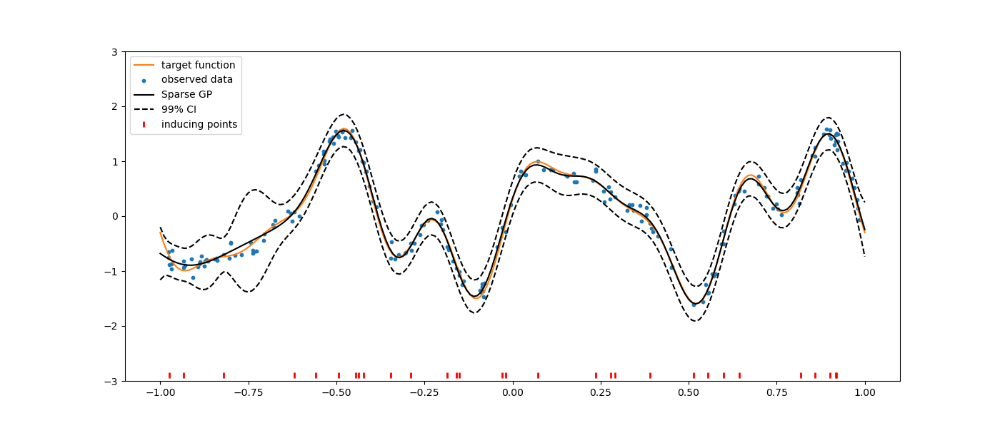
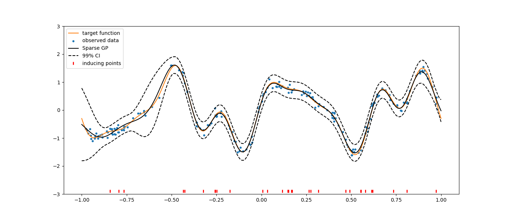

Sparse Gaussian Process (SGP)
=============================

Although the versatility of Gaussian Process regression models for learning complex data, their computational complexity, 
which is :math:`\mathcal{O}(N^3)` with :math:`N` the number of training points, prevent their use to large datasets. 
This complexity results from the inversion of the covariance matrix :math:`\mathbf{K}`. We must also highlight that the memory 
cost of GPR models is :math:`\mathcal{O}(N^2)`, mainly due to the storage of the covariance matrix itself.

To address these limitations, sparse GPs approximation methods have emerged as efficient alternatives. 
Sparse GPs consider a set of inducing points to approximate the posterior Gaussian distribution with a low-rank representation,
while the variational inference provides a framework for approximating the posterior distribution directly. 
Thus, these methods enable accurate modeling of large datasets while preserving computational efficiency 
(typically :math:`\mathcal{O}(NM^2)` time and :math:`\mathcal{O}(NM)` memory for some chosen :math:`M<N`). 

See [1]_ for a detailed information and discussion on several approximation methods benefits and drawbacks.

Implementation
--------------

In SMT the methods: Fully Independent Training Conditional (FITC) method and the Variational Free Energy (VFE) approximation
are implemented inspired from inference methods developed in the GPy project [2]_

In practice, the implementation relies on the expression of their respective negative marginal log
likelihood (NMLL), which is minimised to train the methods. We have the following expressions:

For FITC

.. math :: 
    \text{NMLL}_{\text{FITC}} = \frac{1}{2}\log\left(\text{det}\left(\tilde{\mathbf{Q}}_{NN} + \eta^2\mathbf{I}_N\right)\right) + \frac{1}{2}\mathbf{y}^\top\left(\tilde{\mathbf{Q}}_{NN} + \eta^2\mathbf{I}_N\right)^{-1}\mathbf{y} + \frac{N}{2}\log(2\pi)

For VFE

.. math :: 
    \text{NMLL}_{\text{VFE}} = \frac{1}{2}\log\left(\text{det}\left(\mathbf{Q}_{NN} + \eta^2\mathbf{I}_N\right)\right) + \frac{1}{2}\mathbf{y}^\top\left(\mathbf{Q}_{NN} + \eta^2\mathbf{I}_N\right)^{-1}\mathbf{y} + \frac{1}{2\eta^2}\text{Tr}\left[\mathbf{K}_{NN} + \mathbf{Q}_{NN} \right] + \frac{N}{2}\log(2\pi)

where

.. math ::

    \mathbf{K}_{NN} \approx \mathbf{Q}_{NN} = \mathbf{K}_{NM}\mathbf{K}_{MM}^{-1} \mathbf{K}f_{NM}^\top

    \tilde{\mathbf{Q}}_{NN} = \mathbf{Q}_{NN} + \text{diag}\left[\mathbf{K}_{NN} - \mathbf{Q}_{NN}\right]

and :math:`\eta^2` is the variance of the gaussian noise assumed on training data.

Limitations
-----------

* Inducing points location can not be optimized (a workaround is to provide inducing points as the centroids of k-means clusters over the training data).
* Trend function is assumed to be zero.

.. [1] Matthias Bauer, Mark van der Wilk, and Carl Edward Rasmussen. "Understanding Probabilistic Sparse Gaussian Process Approximations". In: Advances in Neural Information Processing Systems. Ed. by D. Lee et al. Vol. 29. Curran Associates, Inc., 2016

.. [2] https://github.com/SheffieldML/GPy

Usage
-----

Using FITC method
^^^^^^^^^^^^^^^^^

.. code-block:: python

  import matplotlib.pyplot as plt
  import numpy as np
  
  from smt.surrogate_models import SGP
  
  def f_obj(x):
      import numpy as np
  
      return (
          np.sin(3 * np.pi * x)
          + 0.3 * np.cos(9 * np.pi * x)
          + 0.5 * np.sin(7 * np.pi * x)
      )
  
  # random generator for reproducibility
  rng = np.random.RandomState(0)
  
  # Generate training data
  nt = 200
  # Variance of the gaussian noise on our trainingg data
  eta2 = [0.01]
  gaussian_noise = rng.normal(loc=0.0, scale=np.sqrt(eta2), size=(nt, 1))
  xt = 2 * rng.rand(nt, 1) - 1
  yt = f_obj(xt) + gaussian_noise
  
  # Pick inducing points randomly in training data
  n_inducing = 30
  random_idx = rng.permutation(nt)[:n_inducing]
  Z = xt[random_idx].copy()
  
  sgp = SGP()
  sgp.set_training_values(xt, yt)
  sgp.set_inducing_inputs(Z=Z)
  # sgp.set_inducing_inputs()  # When Z not specified n_inducing points are picked randomly in traing data
  sgp.train()
  
  x = np.linspace(-1, 1, nt + 1).reshape(-1, 1)
  y = f_obj(x)
  hat_y = sgp.predict_values(x)
  var = sgp.predict_variances(x)
  
  # plot prediction
  plt.figure(figsize=(14, 6))
  plt.plot(x, y, "C1-", label="target function")
  plt.scatter(xt, yt, marker="o", s=10, label="observed data")
  plt.plot(x, hat_y, "k-", label="Sparse GP")
  plt.plot(x, hat_y - 3 * np.sqrt(var), "k--")
  plt.plot(x, hat_y + 3 * np.sqrt(var), "k--", label="99% CI")
  plt.plot(Z, -2.9 * np.ones_like(Z), "r|", mew=2, label="inducing points")
  plt.ylim([-3, 3])
  plt.legend(loc=0)
  plt.show()
  
::

  ___________________________________________________________________________
     
                                      SGP
  ___________________________________________________________________________
     
   Problem size
     
        # training points.        : 200
     
  ___________________________________________________________________________
     
   Training
     
     Training ...
     Training - done. Time (sec):  0.5234361
  ___________________________________________________________________________
     
   Evaluation
     
        # eval points. : 201
     
     Predicting ...
     Predicting - done. Time (sec):  0.0000000
     
     Prediction time/pt. (sec) :  0.0000000
     
  

Using VFE method
^^^^^^^^^^^^^^^^

.. code-block:: python

  import matplotlib.pyplot as plt
  import numpy as np
  
  from smt.surrogate_models import SGP
  
  def f_obj(x):
      import numpy as np
  
      return (
          np.sin(3 * np.pi * x)
          + 0.3 * np.cos(9 * np.pi * x)
          + 0.5 * np.sin(7 * np.pi * x)
      )
  
  # random generator for reproducibility
  rng = np.random.RandomState(42)
  
  # Generate training data
  nt = 200
  # Variance of the gaussian noise on our training data
  eta2 = [0.01]
  gaussian_noise = rng.normal(loc=0.0, scale=np.sqrt(eta2), size=(nt, 1))
  xt = 2 * rng.rand(nt, 1) - 1
  yt = f_obj(xt) + gaussian_noise
  
  # Pick inducing points randomly in training data
  n_inducing = 30
  random_idx = rng.permutation(nt)[:n_inducing]
  Z = xt[random_idx].copy()
  
  sgp = SGP(method="VFE")
  sgp.set_training_values(xt, yt)
  sgp.set_inducing_inputs(Z=Z)
  sgp.train()
  
  x = np.linspace(-1, 1, nt + 1).reshape(-1, 1)
  y = f_obj(x)
  hat_y = sgp.predict_values(x)
  var = sgp.predict_variances(x)
  
  # plot prediction
  plt.figure(figsize=(14, 6))
  plt.plot(x, y, "C1-", label="target function")
  plt.scatter(xt, yt, marker="o", s=10, label="observed data")
  plt.plot(x, hat_y, "k-", label="Sparse GP")
  plt.plot(x, hat_y - 3 * np.sqrt(var), "k--")
  plt.plot(x, hat_y + 3 * np.sqrt(var), "k--", label="99% CI")
  plt.plot(Z, -2.9 * np.ones_like(Z), "r|", mew=2, label="inducing points")
  plt.ylim([-3, 3])
  plt.legend(loc=0)
  plt.show()
  
::

  ___________________________________________________________________________
     
                                      SGP
  ___________________________________________________________________________
     
   Problem size
     
        # training points.        : 200
     
  ___________________________________________________________________________
     
   Training
     
     Training ...
     Training - done. Time (sec):  0.5836346
  ___________________________________________________________________________
     
   Evaluation
     
        # eval points. : 201
     
     Predicting ...
     Predicting - done. Time (sec):  0.0000000
     
     Prediction time/pt. (sec) :  0.0000000
     
  

Options
-------

.. list-table:: List of options
  :header-rows: 1
  :widths: 15, 10, 20, 20, 30
  :stub-columns: 0

  *  -  Option
     -  Default
     -  Acceptable values
     -  Acceptable types
     -  Description
  *  -  print_global
     -  True
     -  None
     -  ['bool']
     -  Global print toggle. If False, all printing is suppressed
  *  -  print_training
     -  True
     -  None
     -  ['bool']
     -  Whether to print training information
  *  -  print_prediction
     -  True
     -  None
     -  ['bool']
     -  Whether to print prediction information
  *  -  print_problem
     -  True
     -  None
     -  ['bool']
     -  Whether to print problem information
  *  -  print_solver
     -  True
     -  None
     -  ['bool']
     -  Whether to print solver information
  *  -  poly
     -  constant
     -  ['constant']
     -  ['str']
     -  Regression function type
  *  -  corr
     -  squar_exp
     -  ['squar_exp']
     -  ['str']
     -  Correlation function type
  *  -  pow_exp_power
     -  1.9
     -  None
     -  ['float']
     -  Power for the pow_exp kernel function (valid values in (0.0, 2.0]).                 This option is set automatically when corr option is squar, abs, or matern.
  *  -  categorical_kernel
     -  MixIntKernelType.CONT_RELAX
     -  [<MixIntKernelType.CONT_RELAX: 'CONT_RELAX'>, <MixIntKernelType.GOWER: 'GOWER'>, <MixIntKernelType.EXP_HOMO_HSPHERE: 'EXP_HOMO_HSPHERE'>, <MixIntKernelType.HOMO_HSPHERE: 'HOMO_HSPHERE'>, <MixIntKernelType.COMPOUND_SYMMETRY: 'COMPOUND_SYMMETRY'>]
     -  None
     -  The kernel to use for categorical inputs. Only for non continuous Kriging
  *  -  hierarchical_kernel
     -  MixHrcKernelType.ALG_KERNEL
     -  [<MixHrcKernelType.ALG_KERNEL: 'ALG_KERNEL'>, <MixHrcKernelType.ARC_KERNEL: 'ARC_KERNEL'>]
     -  None
     -  The kernel to use for mixed hierarchical inputs. Only for non continuous Kriging
  *  -  nugget
     -  2.220446049250313e-13
     -  None
     -  ['float']
     -  a jitter for numerical stability
  *  -  theta0
     -  [0.01]
     -  None
     -  ['list', 'ndarray']
     -  Initial hyperparameters
  *  -  theta_bounds
     -  [1e-06, 100.0]
     -  None
     -  ['list', 'ndarray']
     -  bounds for hyperparameters
  *  -  hyper_opt
     -  Cobyla
     -  ['Cobyla']
     -  ['str']
     -  Optimiser for hyperparameters optimisation
  *  -  eval_noise
     -  True
     -  [True, False]
     -  ['bool']
     -  Noise is always evaluated
  *  -  noise0
     -  [0.01]
     -  None
     -  ['list', 'ndarray']
     -  Gaussian noise on observed training data
  *  -  noise_bounds
     -  [2.220446049250313e-14, 10000000000.0]
     -  None
     -  ['list', 'ndarray']
     -  bounds for noise hyperparameters
  *  -  use_het_noise
     -  False
     -  [True, False]
     -  ['bool']
     -  heteroscedastic noise evaluation flag
  *  -  n_start
     -  10
     -  None
     -  ['int']
     -  number of optimizer runs (multistart method)
  *  -  xlimits
     -  None
     -  None
     -  ['list', 'ndarray']
     -  definition of a design space of float (continuous) variables: array-like of size nx x 2 (lower, upper bounds)
  *  -  design_space
     -  None
     -  None
     -  ['BaseDesignSpace', 'list', 'ndarray']
     -  definition of the (hierarchical) design space: use `smt.utils.design_space.DesignSpace` as the main API. Also accepts list of float variable bounds
  *  -  random_state
     -  41
     -  None
     -  ['NoneType', 'int', 'RandomState']
     -  Numpy RandomState object or seed number which controls random draws                 for internal optim (set by default to get reproductibility)
  *  -  method
     -  FITC
     -  ['FITC', 'VFE']
     -  ['str']
     -  Method used by sparse GP model
  *  -  n_inducing
     -  10
     -  None
     -  ['int']
     -  Number of inducing inputs
